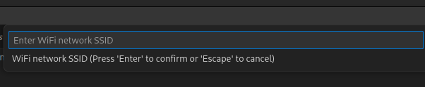
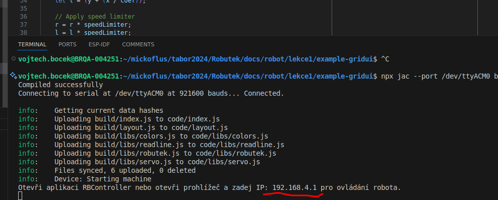

# Lekce 1.5 - Dálkové ovládání

!!! tip "Pokud už máte zapájené motory a složeného Robůtka, můžete ho vyzkoušet přes dálkové ovládání"

[Stáhnout ZIP s gridui ukázkou](./example-gridui.zip){ .md-button .md-button--primary }

1. Stáhneme si předpřipravený projekt. Otevřete ho ve VSCode.

2. V projektu v `src/index.ts` upravte proměnné `OWNER` a `DEVICE_NAME` v horní části na vaše jméno.

    

2. Na dolní liště ve VSCode klikneme na `Config WiFi`.

3. Vybereme možnost `Add a WiFi network`.

	

4. Do pole zadáme název WiFi sítě. Na táboře použijte wifi pro roboty, `RoboRaj`, heslo je na projektoru.

	

5. Dole v terminálu zadáme heslo WiFi sítě.

	

6. Znovu klikneme na `Config WiFi` a vybereme `Set WiFI to Station mode (connect to wifi)`.

	

## Připojení na Robůtka
Robůtek je teď připojený na WiFi.

### Android
Připojte váš telefon na stejnou WiFi (`RoboRaj` na táboře), a stáhněte si aplikaci `RBController` pro Android.

[Aplikace RBController](https://play.google.com/store/apps/details?id=com.tassadar.rbcontroller&hl=en&pli=1){ .md-button .md-button--primary }

1. Po otevření programu nastavte jméno majitele na to stejné, co jste napsali do `OWNER` proměnné v kódu. Jinak Robůtka neuvidíte!
2. Pokud je telefon na stejné WiFi jako Robůtek, aplikace ho najde a můžete ho ovládat.

### iOS a počítač

1. Po nahrání programu vidíte v terminálu IP Robůtka, nebo jde zjistit příkazem `jac wifi-get`.

    

2. Zadejte tuto IP do prohlížeče, např. `http://192.168.4.1`. Načte se vám stránka s ovládáním.
