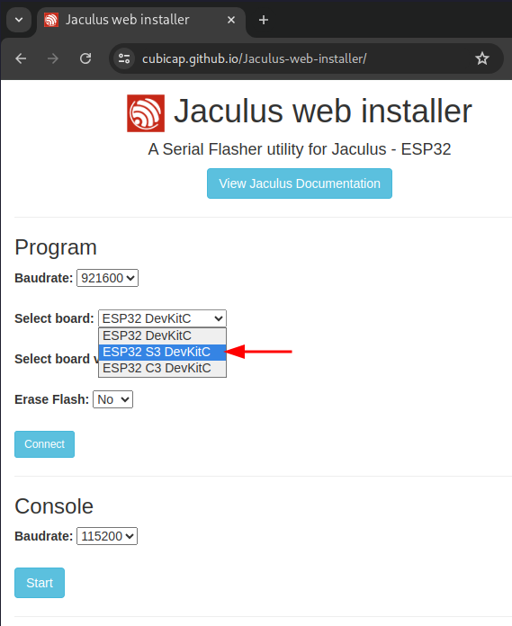
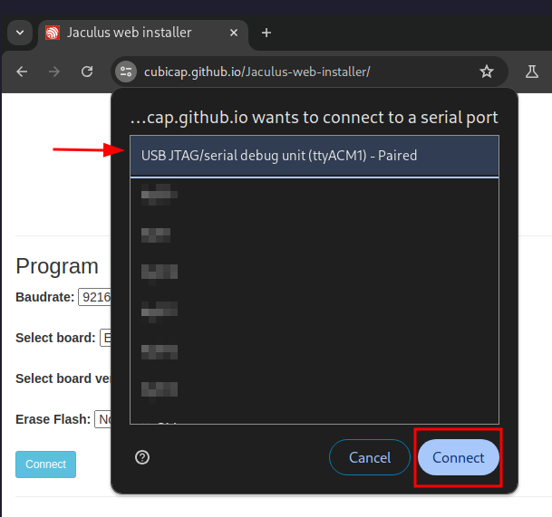

# Lekce 1 - první program

V této lekci si představíme Jaculus, nainstalujeme si programovací prostředí a spustíme první program.

## Instalace

Na našich robotech poběží program, který se jmenuje Jaculus.
Tento program nám umožní jednoduše psát instrukce (programy), které nahrajeme do robota.
Tyto programy budou specifikovat, jak se robot má chovat, a umožní nám s ním komunikovat.
Aby nám všechno správně fungovalo, musíme ho nejprve nainstalovat a k němu i několik dalších programů.

### Jaculus

#### Linux

Na linuxu je třeba přidat oprávnění udev, [více zde](https://docs.espressif.com/projects/esp-idf/en/v5.2.2/esp32s2/api-guides/dfu.html#udev-rule-linux-only).

#### Instalace Jacula

1. Otevřeme si [Jaculus web installer](https://installer.jaculus.org/) v Chrome nebo Edge.

	!!! warning "Tento postup nefunguje ve Firefoxu a jinych prohlížečích, které nepodporují rozhraní WebSerial."

2. Zvolíme desku `ESP32 S3 DevKitC`

	


3. V přepínači `Select board version` vybereme nejnovější dostupnou verzi (tzn. tu s nejvyšším číslem).

4. Přepínač `Erase Flash` slouží k vymazání programů co už jsou nahrané na ESP. Ve výchozím stavu `No` nevymaže programy v ESP.

	

5. Zapneme Robůtka a podržíme tlačítko `IO0`. Současně s ním zmáčkneme tlačítko s popiskem `EN`, které se nachází nalevo od něj. Tímto přepneme robůtka do nahrávacího režimu.

6. Po připojení Robůtka k počítači stiskneme na webové stránce tlačítko `Connect`.

	


7. Ve vyskakovacím okénku zvolíme port `COM` na Windows nebo `ttyACM` na unixových systémech a stiskneme `Connect`.

	


8. Po chvilce se nám zobrazí tlačítko `Flash`, které zmáčkneme.

	

	!!! tip "když nahrávání přes USB-C nefunguje zkuste Micro-USB"


9. Chvíli počkáme a jakmile přestanou v konzoli přibývat nové řádky, máme nainstalovaného Jacula v mikrokontroléru!


### Node.js

Node.js je program, který nám umožní nahrávat kód do Jacula a komunikovat s ním.

1. Stáhneme si [Node.js](https://nodejs.org/en/download) (nejnovější stabilní verzi - LTS) - [Stahuj ZDE pro Windows](http://files.lan/)
2. Nainstalujeme jej dle výchozího nastavení (není potřeba nic měnit).

### Visual Studio Code

Visual Studio Code je programovací prostředí, které nám umožní psát kód a s rozšířením nám dovolí nahrávat kód do zařízení.

1. Stáhneme si [Visual Studio Code](https://code.visualstudio.com/download) (nejnovější stabilní verzi)  - [Stahuj ZDE pro Windows](http://files.lan/)
2. Nainstalujeme jej dle výchozího nastavení (není potřeba nic měnit).

### Jaculus

Nyní už se můžeme vrhnout na samotnou instalaci [`Jacula`](https://jaculus.org/getting-started/).

1. Po instalaci `node.js` **restartujeme** aplikaci Visual Studio Code.
2. V horním menu VSCode vybereme záložku `Terminal` a zvolíme `New Terminal`.
3. Do terminálu zadáme příkaz vypsaný níže. Na `Linuxu` bude nejspíše potřeba `sudo` práva.

	```bash
	npm install -g jaculus-tools
	```

	??? tip "Dostávám chybu"
		Pro aplikování všech změn je nutný restart VSCode. Pokud se vám nedaří nainstalovat Jaculus, zkuste nejdříve restartovat VSCode.

4. Pro otestování instalace zadáme do terminálu příkaz:

	```bash
	npx jac
	```

	Program by měl vypsat nápovědu.

	??? info "Ukázka nápovědy"
		```
		Usage: jac <command>

		Tools for controlling devices running Jaculus

		Commands:
		help            Print help for given command
		list-ports      List available serial ports
		serial-socket   Tunnel a serial port over a TCP socket
		install         Install Jaculus to device
		build           Build TypeScript project
		flash           Flash code to device (replace contents of ./code)
		pull            Download a file/directory from device
		ls              List files in a directory
		read            Read a file from device
		write           Write a file to device
		rm              Delete a file on device
		mkdir           Create a directory on device
		rmdir           Delete a directory on device
		upload          Upload a file/directory to device
		format          Format device storage
		resources-ls    List available resources
		resources-read  Read a resource from device
		get-examples    Get example project from device
		start           Start a program
		stop            Stop a program
		status          Get status of device
		version         Get version of device firmware
		monitor         Monitor program output
		wifi-get        Display current WiFi config
		wifi-ap         Set WiFi to AP mode (create a hotspot)
		wifi-add        Add a WiFi network
		wifi-rm         Remove a WiFi network
		wifi-sta        Set WiFi to Station mode (connect to a wifi)
		wifi-disable    Disable WiFi

		Global options:
		--log-level   Set log level (default: info)
		--help        Print this help message
		--port        Serial port to use (default: first available)
		--baudrate    Baudrate to use (default: 921600)
		--socket      host:port to use
		```


### Jaculus VSCode Rozšíření

Rozšíření pro VSCode nám umožní jednoduše nahrávat kód do Jacula pomocí ikonek a klávesových zkratek.

1. V levém menu VSCode vyberte záložku `Extensions` a vyhledejte `Jaculus`.
	
2. Zvolte `Install`.
3. Po otevření projektu by se vám ve spodní liště měly objevit oranžové ikonky Jacula.
   	

??? note "Používám Windows a nemůžu se připojit přes USB UART"
	Pokud se vám nedaří připojit na USB UART port, je nutné doinstalovat správné drivery.

	1. Stáhněte si <a target="_blank" href="https://www.silabs.com/developers/usb-to-uart-bridge-vcp-drivers">driver</a> pro váš operační systém. Naleznete jej v záložce `Downloads -> Software -> CP210x Universal Windows Driver`.
	2. Rozbalte ZIP soubor a poté pravým tlačítkem klikněte na `silabser.inf` a vyberte `Install`.
	3. Vyzkoušejte, zda se vám podařilo připojit Jaculus. (možná budete muset restartovat počítač).


## První projekt

Zde si vyzkoušíme vytvořit první projekt a nahrát jej do Robůtka.

[Stáhnout ZIP s prvním projektem](./example1.zip){ .md-button .md-button--primary }


1. V prvním kroku si na počítači nachystáme složku `RoboCamp-2024` do které si budeme ukládat veškeré projekty.
2. Dále si [stáhneme zip](./example1.zip) soubor s prvním projektem.
3. Poté si jej **rozbalíme** do vytvořené složky k táboru.
4. Spustíme VSCode a pomocí záložky `File` -> `Open Folder` vybereme složku s projektem.
5. Připojíme Robůtka přes `USB-C`. `micro-USB` požívejte primárně pokud nefunguje nahrávání přes `USB-C`.
6. V levém spodním rohu vybereme :material-power-plug:`Select COM port` pro výběr portu, na kterém je Robůtek připojený. Poté se nápis změní na vybraný port.

	??? tip "Vidím více portů"
		Pokud se vám v nabídce zobrazí více portů, odpojte Robůtka a zjisťete, který port zmizel. Po připojení Robůtka tento port vyberte.
7. Dále zvolíme :material-eye:`Monitor`, ten slouží pro komunikaci se zařízením.

## Nahrání programu

Pokud nám funguje připojení na :material-eye:`Monitor` a běží nám komunikace se zařízením, můžeme do zařízení zkusit nahrát náš první program.

1. Ve VSCode máme otevřený první projekt. V levém `Exploreru` (`Průzkumníku`) vybereme soubor ze  `src` -> `index.ts`. V něm vidíme náš první program.
2. Poté zvolíme :octicons-gear-16:`Build and Flash` pro nahrání programu do zařízení.
	
3. Stejně jako v předchozí části kliknem na tlačítko :material-eye:`Monitor`. Měli bychom vidět výstup z programu.
	```bash
	$ jac monitor --port /dev/tty.usbmodem213101
	Connecting to serial at /dev/tty.usbmodem213101 at 921600 bauds... Connected.

	Robotický tábor 2024, zdraví Jirka Vácha!
	Robotický tábor 2024, zdraví Jirka Vácha!
	```
4. Pro ukončení terminálu, do něj klikneme a stiskneme ++ctrl+c++.
## Úprava programu

Pokud nám funguje nahrávání kódu, můžeme se na něj podívat a zkusit jej upravit.
Ve zdrojovém kódu jsou komentáře (`// tohle je komentář`), které nám popisují, co který řádek dělá.

1. Prostudujeme si zdrojový kód.
2. Upravíme pozdrav na své jméno.

	??? note "Řešení"
		```ts
		...
		console.log("Robotický tábor 2024, zdraví Franta Flinta!");  // tady jsem změnil své jméno
		...
		```

3. Pokusíme se změnit rychlost vypisování.

	??? note "Řešení"
		```ts
		...
		setInterval(() => { /* moj kod */ }, 500); // čas opakování se udává v milisekundách (1000 ms je 1 sekunda)
		...
		```

4. Upravíme barvu.

	??? note "Řešení"
		```ts
		...
		ledStrip.set(0, colors.red); // nastaví barvu LED na Robůtkovi na červenou
		...
		```

		Barvy:

		- `red`
		- `orange`
		- `yellow`
		- `green`
		- `light_blue`
		- `blue`
		- `purple`
		- `pink`
		- `white`
		- `off`


## Ovládání robota přes mobil


[Stáhnout ZIP s gridui ukázkou](./example-gridui.zip){ .md-button .md-button--primary }

1. Stáhneme si předpřipravený projekt, který můžeme rovnou nahrát do Robůtka.

2. Na dolní liště ve VSCode klikneme na `Config WiFi`.

3. Vybereme možnost `Add a WiFi network`.

	

4. Do pole zadáme název WiFi sítě.

	

5. Dole v terminálu zadáme heslo WiFi sítě.

	

6. Znovu klikneme na `Config WiFi` a vybereme `Set WiFI to Station mode (connect to wifi)`.

	