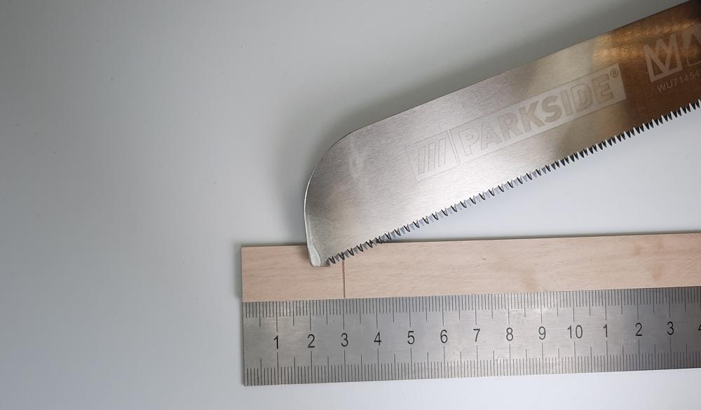
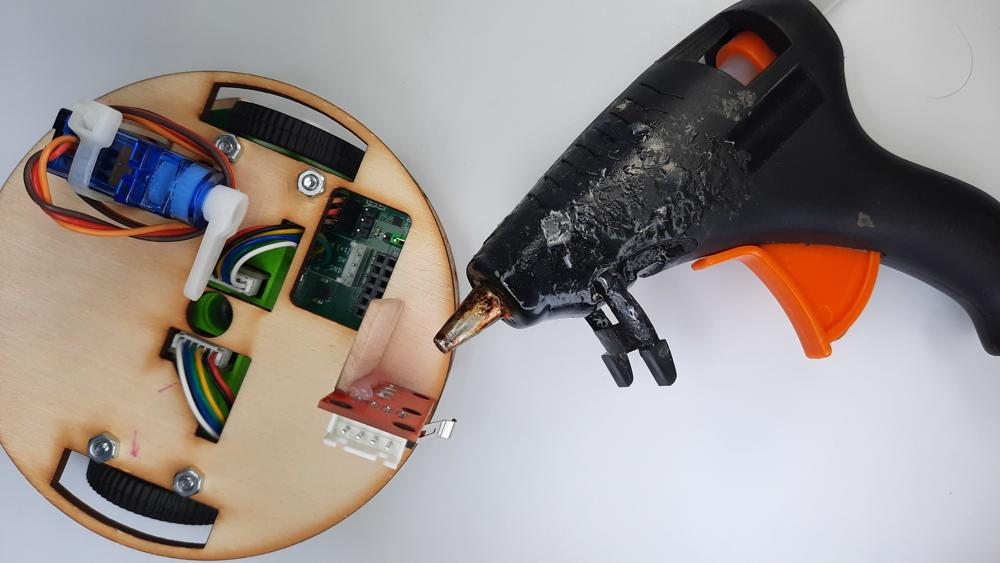

# Tlačítko

!!! comment "Příslušenstí si můžete dát kamkoliv na Robůtka, ale v návodech jsou doporučené pozice."

 
1. Uřizneme si 3 cm dlouhý kus dřevíčka jako držák tlačítka

 
2. Uříznutý kousek si obrousíme aby byl krásně hladký

 
 
3. Teď můžeme přilepit držák k tlačítku pomocí tavné pistole

  
  
4. Když už na tlačítku máme držáček, můžeme to celé přilepit k Robůtkovi

  
  
5. Nakonec si připojíme tlačítko k Robůtkovi pomocí 3x10cm kabelu (jiný než co je v pytlíčku)  

| Tlačítko |     | Robůtek |
| -------- | --- | ------- |
| OUTPUT   | →   | IO1     |
| GND      | →   | GND     |
| VCC      | →   | VCC     |
