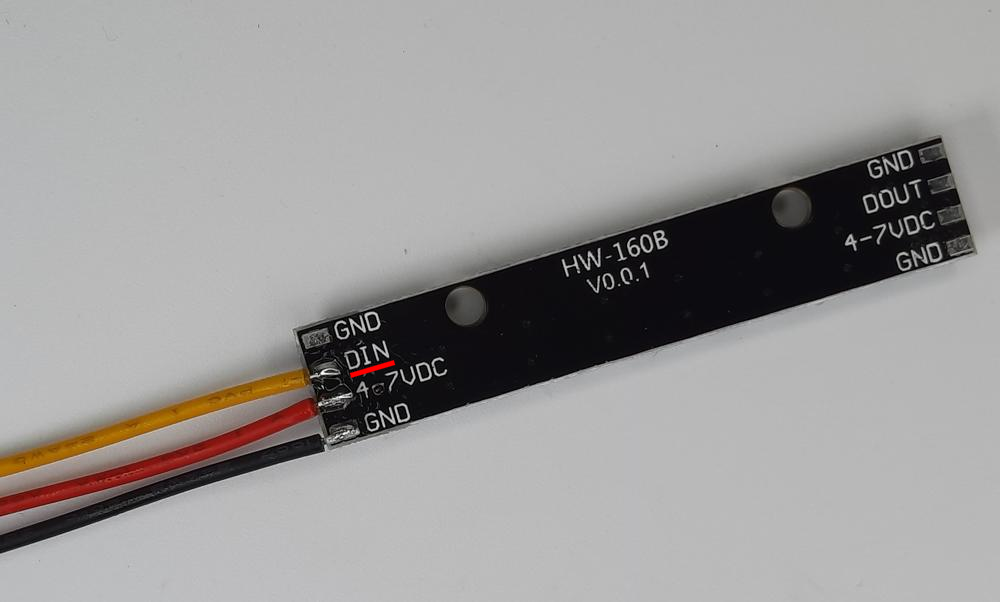

# Příslušenství k Robůtkovi

!!! comment "Příslušenstí si můžete dát kamkoliv na Robůtka, ale v návodech jsou doporučené pozice."

## RGB pásek

1. Ke světlu připájíme kabel pro připojení do robůtka
!!! warning "Dejte si pozor ať kabel nepřipájíte k **DOUT** pinu místo **DIN** pinu"

2. Pásek přilepíme tavnou pistolí k Robůtkovi

## Tlačítko

 
1. Uřizneme si 3cm dlouhý kus dřevíčka jako držák tlačítka

 
2. Uříznutý kousek si obrousíme aby byl krásně hladký

 
 
3. Teď můžeme přilepit držák k tlačítku pomocí tavné pistole

4. Když už na tlačítku máme držáček, můžeme to celé přilepit k Robůtkovi

5. Nakonec si připojíme tlačítko k Robůtkovi pomocí 3x10cm kabelu (jiný než co je v pytlíčku)  
OUTPUT -> IO1  
GND    -> GND  
VCC    -> VCC

## Lidar (vzdálenostní sezor)

1. Uřizneme si dva 2cm dlouhé kusy dřevíčka pro držák Lidaru

2. Uříznuté kousky si obrousíme aby byly krásně hladké

  
  
3. Herkules dáme na delší stranu jednoho z dílů a poté je slepíme do pravého úhlu

4. Když už nám Herkules zaschne, můžeme přilepit držák k Robůtkovi pomocí tavné pistole 

5. K lidaru si připojíme 4x10cm kabel

6. Připojíme lidar modul k Robůtkovi 
VIN -> VCC  
GND -> GND  
SCL -> IO9  
SDA -> IO17

7. Poté přilepíme lidar k držáku pomocí tavné pistole

