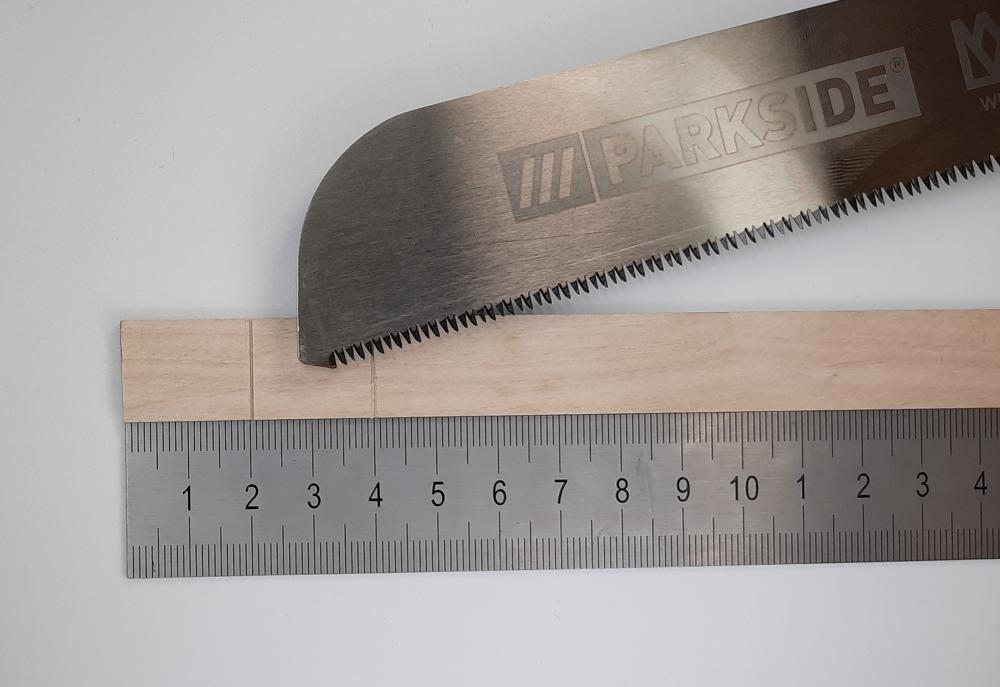
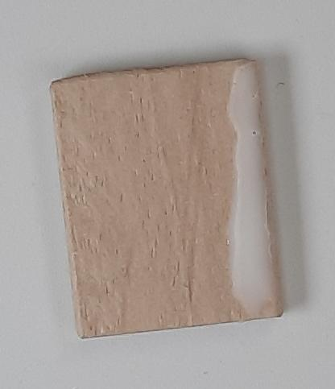
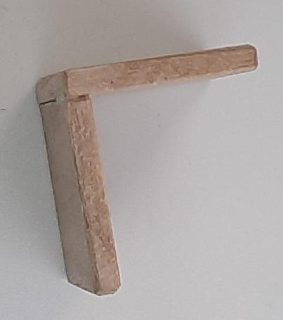

# Lidar (vzdálenostní sezor)

  
1. Uřizneme si dva 2cm dlouhé kusy dřevíčka pro držák Lidaru

  
2. Uříznuté kousky si obrousíme aby byly krásně hladké

  
   
3. Herkules dáme na delší stranu jednoho z dílů a poté je slepíme do pravého úhlu

  
4. Když už nám Herkules zaschne, můžeme přilepit držák k Robůtkovi pomocí tavné pistole

  
5. K lidaru si připojíme 4x10cm kabel

  
  
6. Připojíme lidar modul k Robůtkovi  

| Lidar |     | Robůtek |
| ----- | --- | ------- |
| VIN   | →   | VCC     |
| GND   | →   | GND     |
| SCL   | →   | IO9     |
| SDA   | →   | IO17    |

  
7. Poté přilepíme lidar k držáku pomocí tavné pistole

