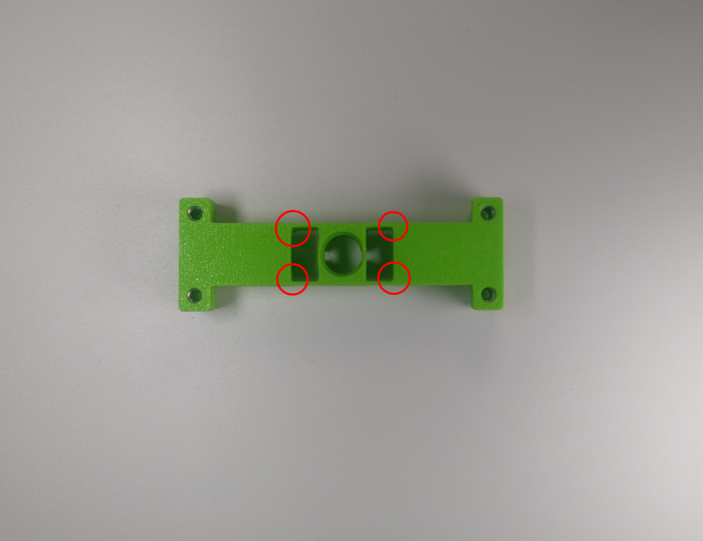

# Stage 1 - Základ
V této kapitole si postavíme samotného Robůtka.

## Seznam potřebných součástek
 - 4 Šroubky M3x20
 - 2 Motorky
 - 2 Kabely
 - 2 Kola
 - 2 Podložky kol
 - Domeček pro motory
 - Malý kartáček
 - Větší kartáček
 - Dřevěná základna
 - Základní deska
 - Baterka
 - Zarážka fixy

## Návod na složení

 
 
1. Ulomíme okraje desky.

 
 
2. Ustřihneme si oba kabely přesně na 5cm (délka měřená bez konektoru). Konce drátků zbavíme izolace pomocí odizolovávacích kleští.

 
 
3. Odizolované konce drátků pocínujeme a připájíme na desku Robůtka ve stejném pořadí, jak na obrázku s bílým drátkem v díře ve tvaru čtverce.

 
 
4. Obrousíme rohy domečku pro motory.

 
 
5. Vsadíme oba motory do domečku a dotlačíme je o hranu stolu.
!!! danger "Ze spodu domečku je uprostřed výstupek, dejte si pozor, abyste ho nezlomili."

 
6. Domeček s motory posadíme na desku. 

 
7. Ze spodu upevníme domeček na mortorky, zarážkou fixy.

 
7. Na osy motorů nasadíme podložky kol (zelenou stranou k motoru).

 
 
8. Kola tak aby prodloužená část kola byla otočená ven z Robůtka.

 
9. Připojíme kabely k motorům.

 
10. Robůtka si otočíme na druhou stranu a ucvakneme zbytky zapájených drátků od motoru.

 
11. Nasadíme dřevěnou základnu.
!!! danger "Základna sedne přesně, jestli si nejste jistí nepoužívejte sílu, zkuste otočit dřevěnou základnu, případně se ptejte."

 
 
12. Přišroubujte dřevěnou základnu a základní desku s krytem motorů k sobě čtiřmi šroubky zespodu.

 
13. Vložíme malý kartáček do malé dírky a větší kartáček do větší dírky (viz obrázek).

 
 
14. Vložíme baterku 
!!! danger "Dejte si pozor na orientaci baterky ověřte si jestli dáváte plus baterky na plus v držáku baterky."

 
15. Máme hotovo!!!

 
