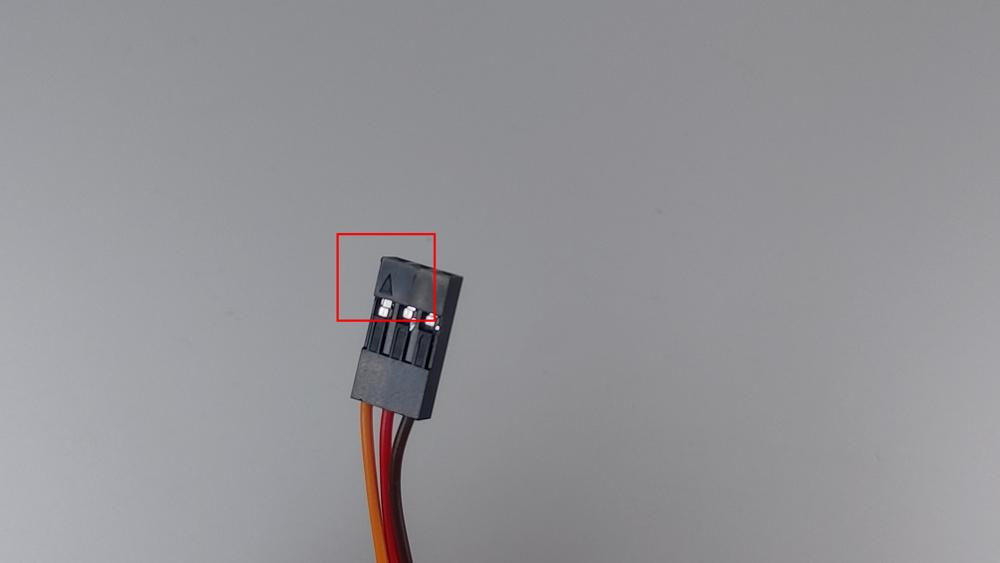
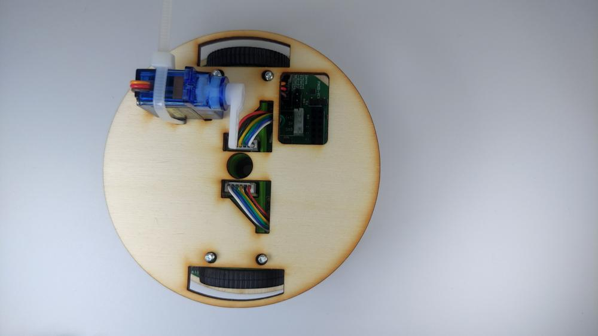
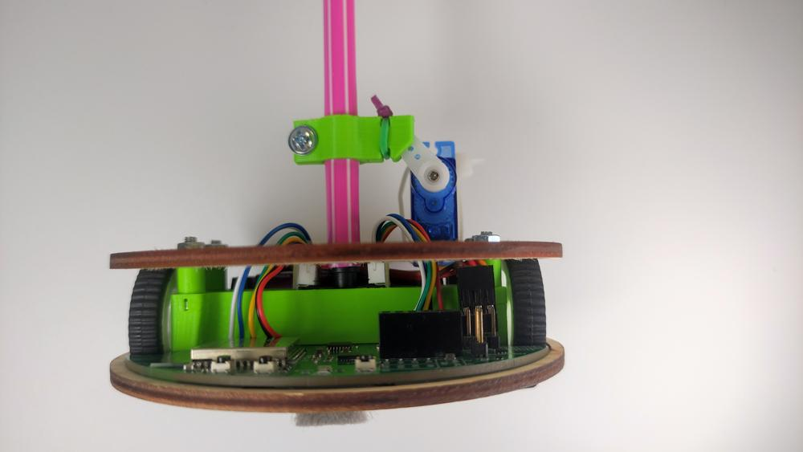

# Stage 2 - Servo, fixa

## Seznam potřebných věcí
 - Robůtka stage 1
 - Vrchní dřevěná deska
 - Servo
 - Stahovací zip páska
 - Fixa
 - Šroubek
 - 5 matek
 - Držák na fixu
 - 4 Distanční sloupky

## Návod na složení

 
1. Připravíme si fixu, držák na fixu, šroubek, matku a přípravek.

 
2. Nasuneme držák na fixu

 
3. Nasuneme na fixu přípravek. Zatlačíme až na doraz.

 
4. Držák přitiskneme k přípravku.
!!! danger "Přípravek je udělán tak, aby držák seděl na fixe přesně."

 
5. Nasadíme na držák šroubek a matku.

 
6. Sešroubujeme.

 
7. Připravíme si Robůtka stage 1 a na šrouby zvrchu dáme distanční sloupky.

 
8. Protáhneme kabel od serva vrchní dřevěnou deskou.

 
9. Posadíme servo na vrchní dřevěnou desku.

 
10. Protáhneme stahovací pásku kolem serva jako na obrázku.

 
 
11. Utáhneme sthovací pásku kolem serva.

 
 
12. Připojíme konektor kablu serva ke tří-pinu na základní desce Robůtka, tak jako na obrázku.
!!! danger "Šipka na konektoru jde na datový pin na desce!"

 
13. Posadíme vrchní dřevěnou desku se servem na šrouby s distančními sloupky.

 
14. Přišroubujeme vrchní dřevěnou desku maticemi ke zbytku Robůtka.

 
 
15. Odštípneme přečnívající stahovací pásku.

 
16. Vezmeme si jednu gumičku a zasukujeme ji.

 
17. Zasukovanou gumičku nasadíme na fixu tak, jako na obrázku.

 
18. Fixu nasadíme na Robůtka způsobem ukázaným na obrázku..

 
19. Máme hotovo!!!

