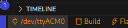
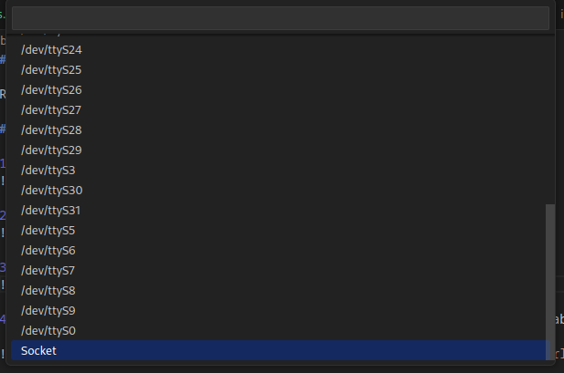
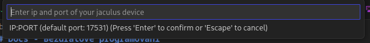

# Docs - Bezdrátové programování

Robůtka můžeme monitoroovat a programovat bezdrátově.

## Připojení k Robůtkovi

1. Klikneme na tlačítko vybírání portu (někdy zůstane předvyplněný z minula) 
  

2. Vybereme `Socket` (úplně dole) 
  

3. Zadáme IP adresu ([získání IP adresy](../wifi/#zjištení-ip-adresy))  
  

4. Poté můžeme bezdrátově programovat jako kdyby byl Robůtek připojený kabelem.

    !!! warning "Někdy bůže nastat chyba. Pokud nastane, stačí zmáčknout `Ctrl+C` a zkusit to znovu."