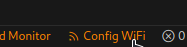
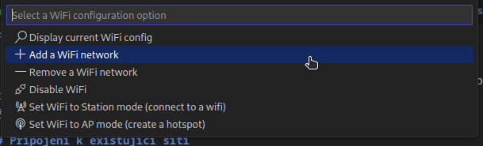
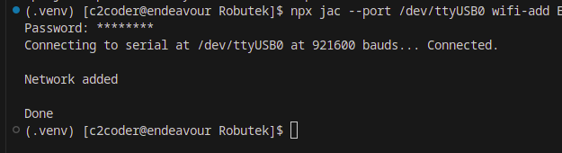
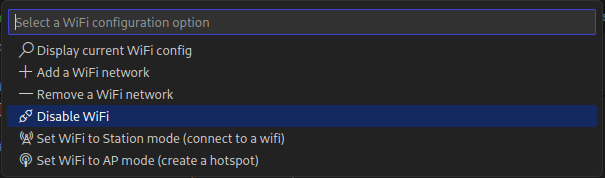

# Docs - WiFi

K Robůtkovi se můžeme připojit i bezdrátově pomocí WiFi. K tomu ale potřebujeme aby se Robůtek buď [připojil k existující síti](#pripojeni-k-existujici-siti) nebo [vytvořil novou síť](#vytvoreni-nove-site).

## Připojení k existující síti

1. Klikneme na tlačítko `Config WiFi` na dolní liště. Zde budeme dělat všechno nastavení WiFi. <br>
 <br>

2. Vybereme možnost `Add WiFi network`.
 <br>

3. A zadáme název sítě (SSID)
 <br>

    !!! note "Co dělat když název sítě má v sobě mezeru"
        - Pokud název sítě má v sobě mezeru, musíme ho vložit do uvozovek, například `"Hele mezera"`.

4. Dole v terminále se nám zobrazí místo na zadání hesla.
 <br>

5. Po zadání hesla be se nám zobrazí správa že vše proběhlo v pořádku.
 <br>

6. Poté musíme znovu kliknout na tlačítko `Config WiFi` a vybrat možnost `Set WiFI to Station mode (connect to WiFi)`.
 <br>

## Vytvoření nové sítě

1. Klikneme na tlačítko `Config WiFi` na dolní liště. Zde budeme dělat všechno nastavení WiFi. <br>
 <br>

2. Vybereme možnost `Set WiFi to AP mode (create a hotspot)`.
 <br>

3. A zadáme název sítě (SSID)
 <br>

    !!! note "Co dělat když název sítě má v sobě mezeru"
        - Pokud název sítě má v sobě mezeru, musíme ho vložit do uvozovek, například `"Hele mezera"`.

4. Dole v terminále se nám zobrazí místo na zadání hesla.
 <br>

## Vypnutí WiFi

1. Klikneme na tlačítko `Config WiFi` na dolní liště. <br>
 <br>

2. Vybereme možnost `Disable WiFi`.
 <br>

## Zjištení IP adresy

1. Klikneme na tlačítko `Config WiFi` na dolní liště. <br>
 <br>

2.  Vybereme možnost `Display current WiFI config`.<br>
 <br>

3. A v terminále se zobrazí IP adresa (Nějakou dobu trvá než se Robůtek připojí k sítí, takže je možné že to bude chvíly trvat) <br>
 <br>

Nebo v kódu můžete získat IP adresu pomocí funkce `currentIp()`:

```ts
import * as wifi from "wifi";

console.log(wifi.currentIp())
```

## Připojení k síti

1.