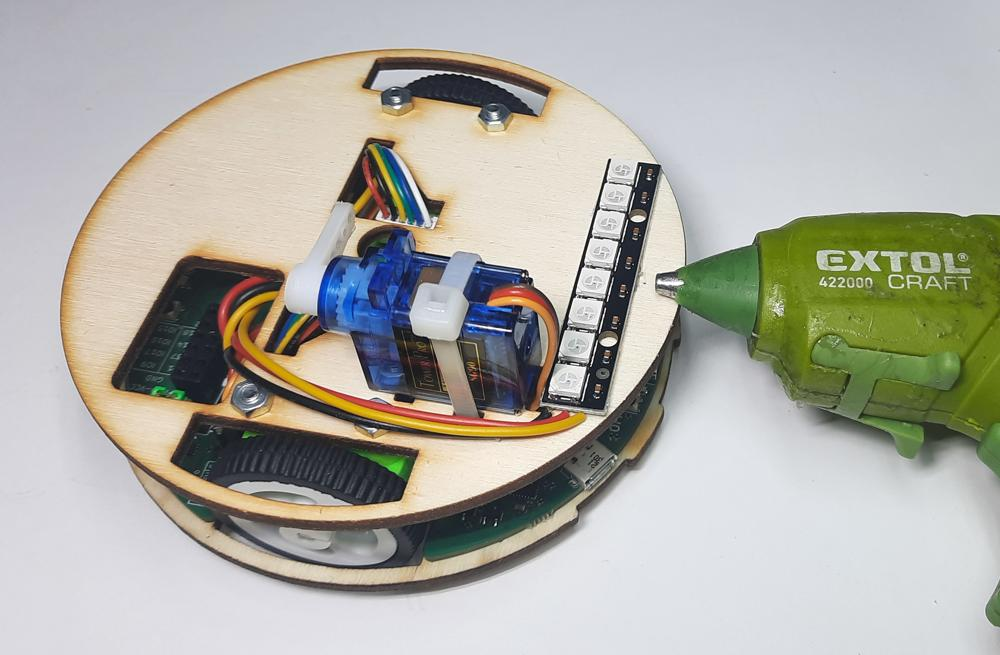

# RGB pásek

!!! comment "Příslušenstí si můžete dát kamkoliv na Robůtka, ale v návodech jsou doporučené pozice."

1. K pásku připájíme kabel pro připojení do robůtka.

    !!! warning "Dejte si pozor ať kabel nepřipájíte k **DOUT** pinu místo **DIN** pinu."
    

2. Pásek připojíme k Robůtkovi.

    !!! comment "Žlutý drát patří doprava."
    

3. Pásek přilepíme tavnou pistolí k Robůtkovi.

    

