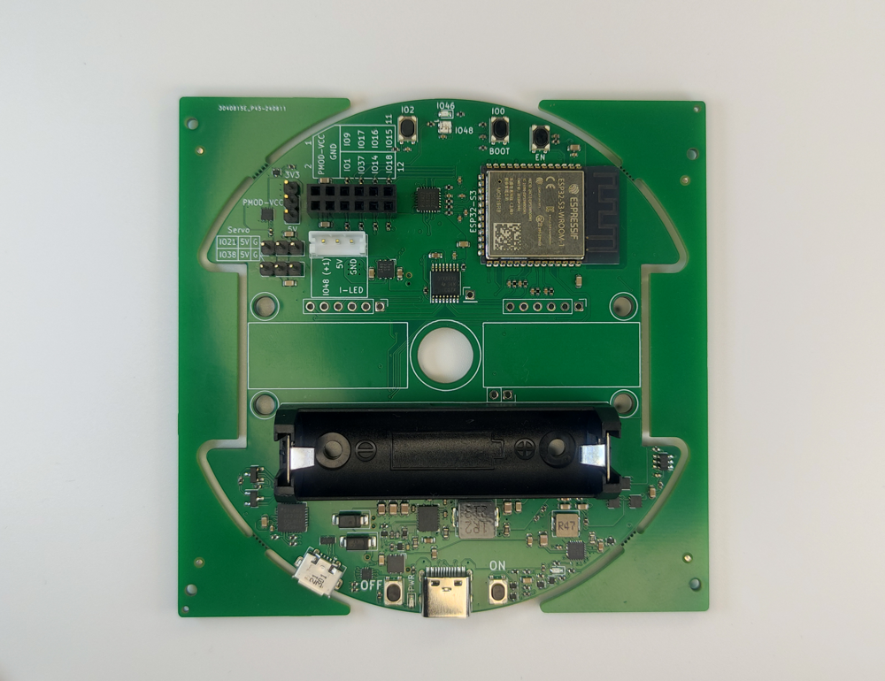
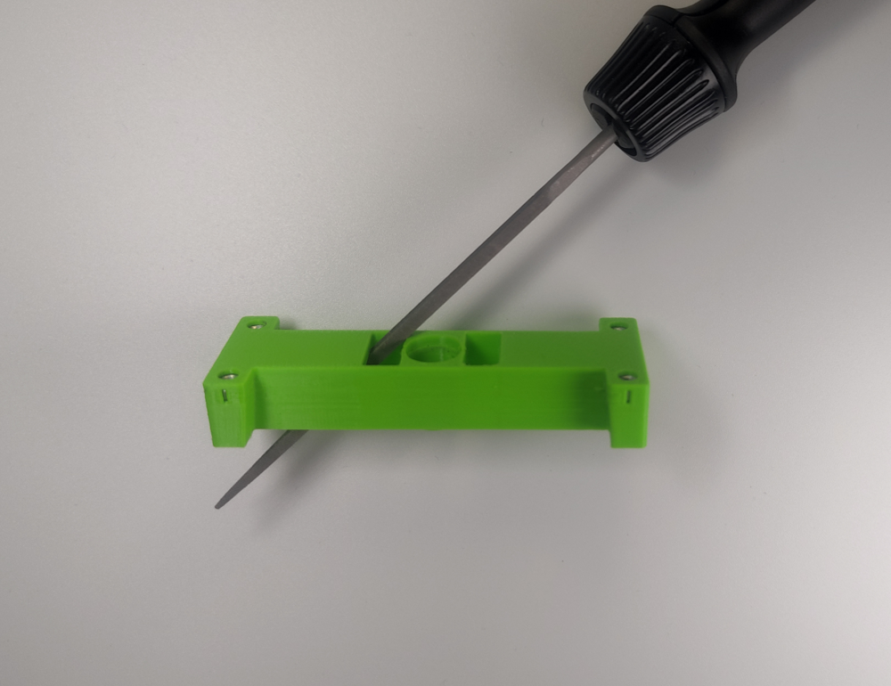
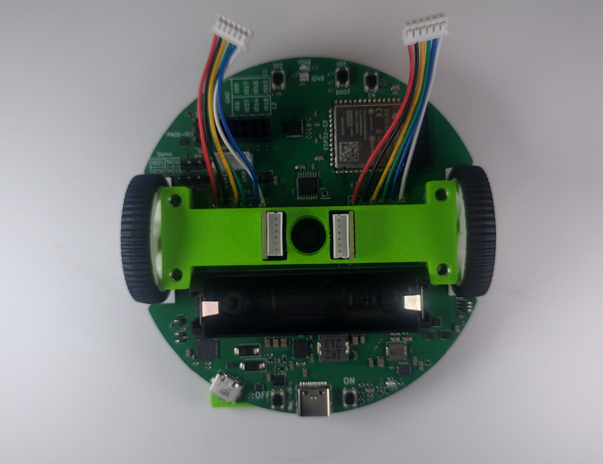
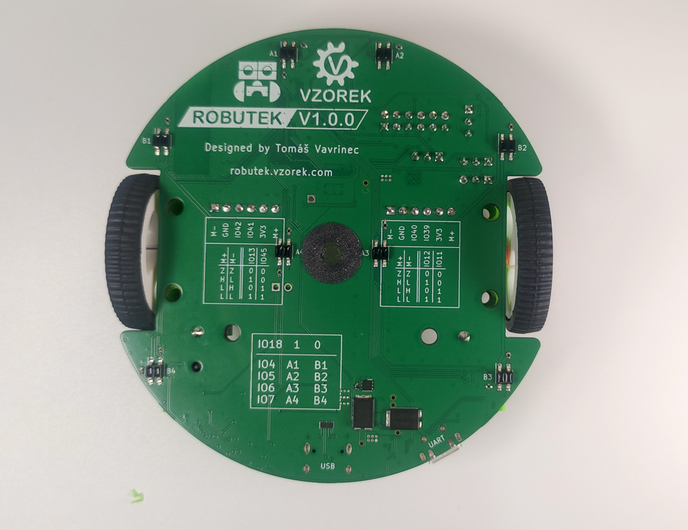

# Stage 1 - Základ
V této kapitole si postavíme samotného Robůtka.

## Seznam potřebných součástek

 - 4 šroubky M3x30
 - 2 motorky
 - 2 kabely
 - 2 kola
 - 2 podložky kol
 - Domeček pro motory
 - Malý kartáček
 - Větší kartáček
 - Dřevěná základna
 - Základní deska
 - Baterie 14500
 - Zarážka fixy

## Návod na složení

1. Ulomíme okraje desky (některé už jsou odlámané).

    
    

2. Ustřihneme si oba kabely přesně na 5cm (délka měřená bez konektoru). Konce drátků zbavíme izolace pomocí odizolovávacích kleští.

    
    

3. Odizolované konce drátků pocínujeme a připájíme na desku Robůtka ve stejném pořadí jako na obrázku - s bílým drátkem v díře ve tvaru čtverce.

    
    

4. Obrousíme rohy domečku pro motory.

    
    

5. Vsadíme oba motory do domečku a dotlačíme je o hranu stolu.

    !!! danger "Ze spodu domečku je uprostřed výstupek, dejte si pozor, abyste ho nezlomili."
    
    

6. Domeček s motory posadíme na desku.

    

7. Ze spodu upevníme domeček na motorky zarážkou fixy.

    

7. Na osy motorů nasadíme podložky kol (zelenou stranou k motoru).

    

8. Nasadíme kola tak aby byla prodloužená část kola otočená ven z Robůtka.

    
    

9. Připojíme kabely k motorům.

    

10. Robůtka si otočíme na druhou stranu, ucvakneme zbytky zapájených drátků od motoru a vyčistíme desku.

    

11. Nasadíme dřevěnou základnu.

    !!! danger "Základna sedne přesně, jestli si nejste jistí, nepoužívejte sílu, zkuste otočit dřevěnou základnu, případně se ptejte."
    

12. Přišroubujte dřevěnou základnu a základní desku s krytem motorů k sobě čtyřmi šroubky zespodu.

    

13. Vložíme malý kartáček do malé dírky a větší kartáček do větší dírky (viz obrázek).

    

14. Vložíme baterii.

    !!! danger "Dejte si pozor na orientaci baterie - ověřte si, že dáváte plus baterie na plus držáku."
    
    

15. Máme hotovo!!!

    
