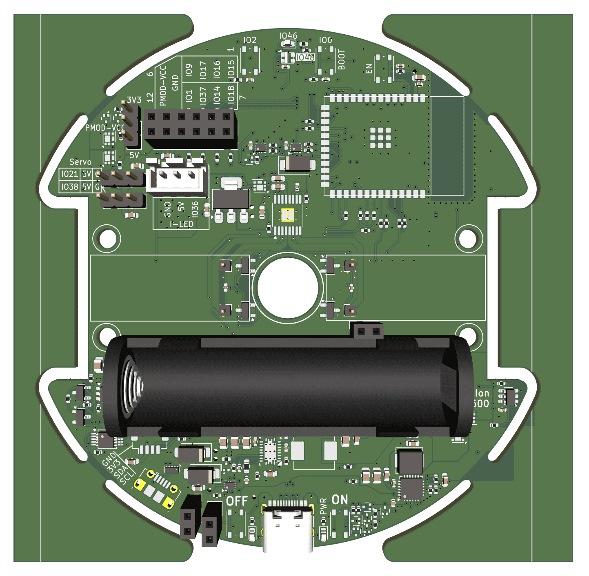

# Hardware Reference

Tato sekce shrnuje hardwarové vlastnosti Robůtka.

## Obecné hardwarové koncepty

V hardwaru Robůtka jsou použity zejména tyto periferie:

- `GPIO` pro digitální vstupy a výstupy
- `ADC` pro čtení analogových hodnot z odrazových senzorů
- `PWM` pro řízení serv a motorů
- `kvadraturní enkodéry` pro zpětnou vazbu pohybu motorů
- `I2C` pro senzory
- `WS2812B` pro RGB podsvícení

## Obsah sekce

- [Pinout a konektory](pinout.md)
- [Vestavěné senzory](sensors.md)
- [Akční členy a LED](actuators.md)
- [Externí moduly](expansion.md)

