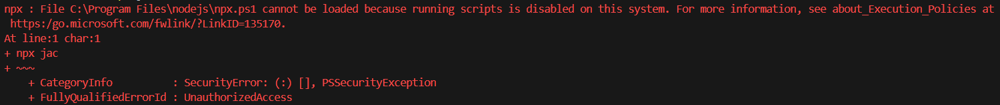

# Často kladené dotazy

## Do kterého USB mám připojit kabel?

- Používej konektor `USB-C`, pokud ti nejde nahrát kód, použij `micro-USB`.
- ??? "Proč USB-C nefunguje?"
  `USB-C` je softwarové `USB` na ESP32. Pokud nahraješ kód, který rozbije ESP, `USB-C` nebude fungovat. Naopak `micro-USB` je připojené přes převodník, takže bude fungovat i když má ESP problém. (potenciální chyby: chyba při nahrávání, nekonečná smyčka v kódu, atd.).

## Jak komunikovat se zařízením?

- V levém spodním rohu vyberte COM port (`Select COM Port`).
- Poté je možné spustit monitor (`Monitor`) skrze tlačítko v levém spodním rohu.
- Následně se vám otevře terminál, ve kterém vidíte výstup ze zařízení.

## Jak se odpojit od zařízení?

- Pomocí klaves ++ctrl+c++ se odpojíte z monitoru.

## Jak zjistit verzi firmwaru v Jaculu?

- Připojte Robůtka k počítači.
- Pomocí ++ctrl+shift+p++ se vám otevře okno pro zadávání příkazů.
- Zadejte `Jaculus: Get firmware version`.
- Výsledek by se měl objevit v terminálu.

## Jak nainstalovat vývojové prostředí?

- Koukni na [Lekci 0](../lekce0/index.md).

## Chyba při spuštění příkazu v konzoli

  - Pokud chyba obsahuje `running scripts is disabled on this system`, otevřete si aplikaci `Powershell` a spusťte příkaz `Set-ExecutionPolicy -ExecutionPolicy Unrestricted -Scope CurrentUser`. Poté restartujte všechny konzole, které máme otevřené.

  Chyba vypadá přibližně takto.

  

