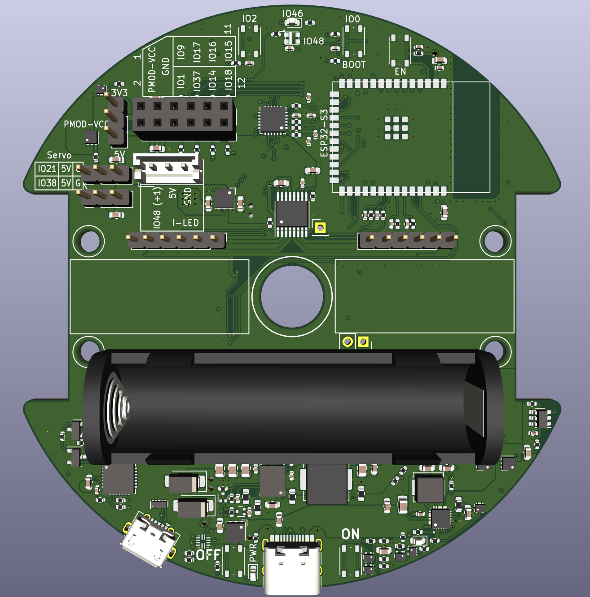
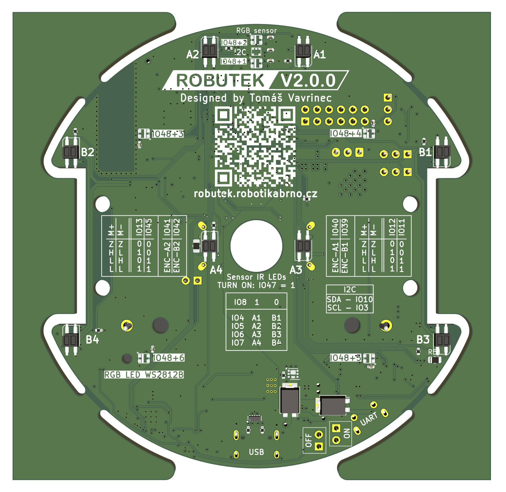

# Programování robota

## Programování:
Robůtek je řízený mikrokontrolérem ESP32-S3. K programování budeme používat jazyk TypeScript, který budeme spouštět pomocí programu [Jaculus](https://jaculus.org/).

Robůtka je samozřejmě možné programovat i v jíných jazycích, například C/C++ pod ESP-IDF, nebo Arduino. Pro tyto účely se dokumnetace stále dá použít jako zdroj informací, i když ne ukázek kódu.

[Lekce 0](lekce0/){ .md-button .md-button--primary }

## Přehled pinů
Čísla pinů nemusíme přepisovat ručně, lze použít definici z knihovny:

```typescript
import * as gpio from "gpio";
import { createRobutek } from "./libs/robutek.js"
const robutek = createRobutek("V2");

gpio.pinMode(robutek.Pins.StatusLED, gpio.PinMode.OUTPUT);
gpio.write(robutek.Pins.StatusLED, 1)
```

Pro kompletnost je pinout k nahlédnutí zde:

```typescript
enum Pins {
    StatusLED = 46,

    ILED = 48,
    ILEDConnector = 36,

    ButtonLeft =  2,
    ButtonRight = 0,

    Servo1 = 21,
    Servo2 = 38,

    Sens1 = 4,
    Sens2 = 5,
    Sens3 = 6,
    Sens4 = 7,

    SensSW = 8,
    SensEN = 47,

    Motor1A = 11,
    Motor1B = 12,
    Motor2A = 45,
    Motor2B = 13,
    Enc1A = 40,
    Enc1B = 39,
    Enc2A = 41,
    Enc2B = 42,

    SDA = 10,
    SCL = 3
}
```



