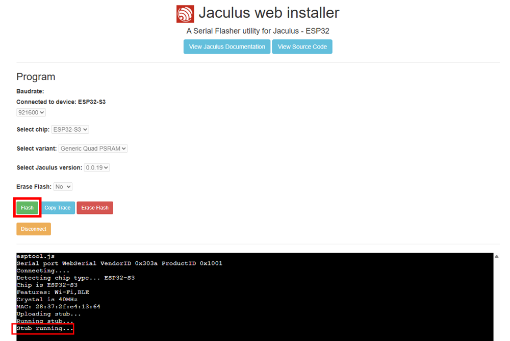

# Lekce 0 - Instalace prostředí

V této lekci si představíme Jaculus, nainstalujeme si programovací prostředí a spustíme první program.

## Instalace

Na našich robotech poběží program, který se jmenuje Jaculus.
Tento program nám umožní jednoduše psát instrukce (programy), které nahrajeme do robota.
Tyto programy budou specifikovat, jak se robot má chovat, a umožní nám s ním komunikovat.
Aby nám všechno správně fungovalo, musíme ho nejprve nainstalovat a k němu i několik dalších programů.

### Jaculus

#### Linux

Na linuxu je třeba přidat oprávnění udev, [více zde](https://docs.espressif.com/projects/esp-idf/en/v5.2.2/esp32s2/api-guides/dfu.html#udev-rule-linux-only).

#### Instalace Jacula

1. Otevřeme si [Jaculus web installer](https://installer.jaculus.org/?baudrate=921600&chip=ESP32-S3&variant=ESP32-S3-Generic-QuadPSRAM&version=latest&erase=noErase) v Chrome nebo Edge.

    !!! warning "Tento postup nefunguje ve Firefoxu a jinych prohlížečích, které nepodporují rozhraní WebSerial."

2. Zvolíme desku `ESP32-S3` a variantu `Generic Quad PSRAM`

    


3. V přepínači `Select board version` vybereme nejnovější dostupnou verzi (tzn. tu s nejvyšším číslem).

4. Přepínač `Erase Flash` slouží k vymazání programů co už jsou nahrané na ESP. Ve výchozím stavu `No` nevymaže programy v ESP.

    

    !!! danger "Přepnutí do Nahrávacího módu"
        Vypneme Robůtka, držíme tlačítko popsané `BOOT` a zapneme Robůtka.

5. Připojíme Robůtka k počítači přes `USB-C`

6. Po připojení Robůtka k počítači stiskneme na webové stránce tlačítko `Connect`.

    


7. Ve vyskakovacím okénku zvolíme port `COM` na Windows nebo `ttyACM` na unixových systémech a stiskneme `Connect`.

    


8. Počkáme, až se v konzoli zobrazí `Stub running...`. Poté zmáčkneme tlačítko `Flash`.

    

    !!! tip "Pokud nefunguje nahrávání přes USB-C, zkuste Micro-USB"


9. Jakmile se v konzoli objeví `Leaving...`, flashování je dokončeno a můžeme kliknout na tlačítko `Disconnect`. 

!!! warning "Instalace programů" 

    Po stáhnutí programů (například Node.js a Visual Studio Code) je potřeba je i nainstalovat. K tomu slouží instalační soubor. Měl by se nacházet ve složce `Download`. Jméno souboru by mělo být podobné názvu programu.


<!-- TODO after camp change file download links to www -->

### Node.js

Node.js je program, který nám umožní nahrávat kód do Jacula a komunikovat s ním.

1. Stáhneme si `Node.js` (nejnovější stabilní verzi - LTS) - [Stahuj ZDE pro Windows](http://files.lan/).
2. Nainstalujeme jej dle výchozího nastavení (není potřeba nic měnit).

### Visual Studio Code

Visual Studio Code je programovací prostředí, které nám umožní psát kód a s rozšířením nám dovolí nahrávat kód do zařízení.

1. Stáhneme si `Visual Studio Code` (nejnovější stabilní verzi)  - [Stahuj ZDE pro Windows](http://files.lan/). 
2. Nainstalujeme jej dle výchozího nastavení (není potřeba nic měnit).

### Jaculus

Nyní už se můžeme vrhnout na samotnou instalaci [`Jacula`](https://jaculus.org/getting-started/).

1. Po instalaci `node.js` **restartujeme** aplikaci Visual Studio Code.
2. V horním menu VSCode vybereme záložku `Terminal` a zvolíme `New Terminal`.
3. Do terminálu zadáme příkaz vypsaný níže. Na `Linuxu` bude nejspíše potřeba `sudo` práva.

    ```bash
    npm install -g jaculus-tools
    ```

    !!! tip "Dostávám chybu"
        Pro aplikování všech změn je nutný restart VSCode. Pokud se vám nedaří nainstalovat Jaculus, zkuste nejdříve restartovat VSCode.

4. Pro otestování instalace zadáme do terminálu příkaz:

    ```bash
    npx jac
    ```

    Program by měl vypsat nápovědu.

    ??? info "Ukázka nápovědy"
        ```
        Usage: jac <command>

        Tools for controlling devices running Jaculus
        
        Commands:
          help            Print help for given command                       
          list-ports      List available serial ports                        
          serial-socket   Tunnel a serial port over a TCP socket             
          install         Install Jaculus to device                          
          build           Build TypeScript project                           
          flash           Flash code to device (replace contents of ./code)  
          pull            Download a file/directory from device              
          ls              List files in a directory                          
          read            Read a file from device                            
          write           Write a file to device                             
          rm              Delete a file on device                            
          mkdir           Create a directory on device                       
          rmdir           Delete a directory on device                       
          upload          Upload a file/directory to device                  
          format          Format device storage                              
          project-create  Create project from package                        
          project-update  Update existing project from package skeleton      
          resources-ls    List available resources                           
          resources-read  Read a resource from device                        
          start           Start a program                                    
          stop            Stop a program                                     
          status          Get status of device                               
          version         Get version of device firmware                     
          monitor         Monitor program output                             
          wifi-get        Display current WiFi config                        
          wifi-ap         Set WiFi to AP mode (create a hotspot)             
          wifi-add        Add a WiFi network                                 
          wifi-rm         Remove a WiFi network                              
          wifi-sta        Set WiFi to Station mode (connect to a wifi)       
          wifi-disable    Disable WiFi                                       
        
        Global options:
          --log-level   Set log level (default: info)                  
          --help        Print this help message                        
          --port        Serial port to use (default: first available)  
          --baudrate    Baudrate to use (default: 921600)              
          --socket      host:port to use 
        ```


### Jaculus VSCode rozšíření

Rozšíření pro VSCode nám umožní jednoduše nahrávat kód do Jacula pomocí ikonek a klávesových zkratek.

1. V levém menu VSCode vyberte záložku `Extensions` a vyhledejte `Jaculus`.
    
2. Zvolte `Install`.
3. Používání Jaculu

    - Po otevření projektu by se vám ve spodní liště měly objevit oranžové ikonky Jacula. 
    

    - V boční liště by se měla objevit záložka Jaculus, přes kterou můžete vytovřit projekt a následně spouštět Jaculus příkazy.
    


<!-- TODO doesnt rly make sense? who know what is USB UART -->

??? note "Používám Windows a nemůžu se připojit přes USB UART"
    Pokud se vám nedaří připojit na USB UART port, je nutné doinstalovat správné drivery.

    1. Stáhněte si <a target="_blank" href="https://www.silabs.com/developers/usb-to-uart-bridge-vcp-drivers">driver</a> pro váš operační systém. Naleznete jej v záložce `Downloads -> Software -> CP210x Universal Windows Driver`.
    2. Rozbalte ZIP soubor a poté pravým tlačítkem klikněte na `silabser.inf` a vyberte `Install`.
    3. Vyzkoušejte, zda se vám podařilo připojit Jaculus. (možná budete muset restartovat počítač).

!!! tip "Něco ti nefunguje?"
    Podívej se na [Často kladené dotazy](../faq/index.md)