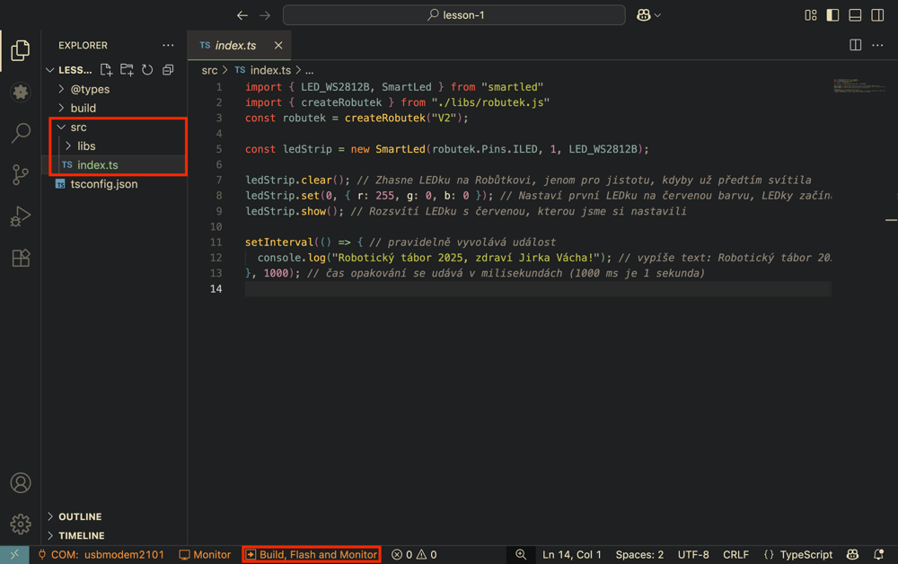
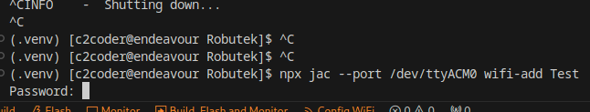

# Lekce 1 - První projekt

Zde si vyzkoušíme vytvořit první projekt a nahrát jej do Robůtka.

=== "Přes VS Code rozšíření"

    ```
    https://robutek.robotikabrno.cz/v2/robot/lekce1/example1.tar.gz
    ```

    1. V prvním kroku si na počítači nachystáme složku `RoboCamp-2025`, do které si budeme ukládat veškeré projekty.
    2. Dále v rozšíření Jaculus vybereme `Create Project`.
    3. Zvolíme umístění projektu do složky `RoboCamp-2025`.
    4. Zadáme název projektu, např. `prvniProjekt`, potvrdíme `Enter`.
    5. Vložíme odkaz na projekt, potvrdíme `Enter`.
    6. Otevře se nám vytvořený projekt.
    7. Připojíme Robůtka přes `USB-C`. Pokud `USB-C` nefunguje, požívejte `micro-USB`.
    8. V levém spodním rohu vybereme :material-power-plug:`Select COM port` pro výběr portu, na kterém je Robůtek připojený. Poté se nápis změní na vybraný port.

        ??? tip "Vidím více portů"
            Pokud se vám v nabídce zobrazí více portů, odpojte Robůtka a zjisťete, který port zmizel. Po připojení Robůtka tento port vyberte.

    9. Dále zvolíme :material-eye:`Monitor`, ten slouží pro komunikaci se zařízením.


=== "Ručně ze zipu"
    [Stáhnout ZIP s prvním projektem](./example1.zip){ .md-button .md-button--primary }

    1. V prvním kroku si na počítači nachystáme složku `RoboCamp-2025`, do které si budeme ukládat veškeré projekty.
    2. Dále si [stáhneme zip](./example1.zip) soubor s prvním projektem.
    3. Poté si jej **rozbalíme** do vytvořené složky k táboru.
    4. Spustíme VSCode a pomocí záložky `File` -> `Open Folder` vybereme složku s projektem.
    5. Připojíme Robůtka přes `USB-C`. Pokud `USB-C` nefunguje, požívejte `micro-USB`.
    6. V levém spodním rohu vybereme :material-power-plug:`Select COM port` pro výběr portu, na kterém je Robůtek připojený. Poté se nápis změní na vybraný port.

        ??? tip "Vidím více portů"
            Pokud se vám v nabídce zobrazí více portů, odpojte Robůtka a zjisťete, který port zmizel. Po připojení Robůtka tento port vyberte.

    7. Dále zvolíme :material-eye:`Monitor`, ten slouží pro komunikaci se zařízením.

## Nahrání programu

Pokud nám funguje připojení na :material-eye:`Monitor` a běží nám komunikace se zařízením, můžeme do zařízení zkusit nahrát náš první program.

1. Ve VSCode máme otevřený první projekt. V levém `Exploreru` (`Průzkumníku`) vybereme soubor ze  `src` -> `index.ts`. V něm vidíme náš první program.
2. Poté zvolíme :material-arrow-right:`Build, Flash and Monitor` pro nahrání programu do zařízení.
	
	<!-- TODO: update 2 and 3 current library and jaculus implementations -->
3. Měli bychom vidět výstup z programu.
	```bash
	$ jac monitor --port COM7
	Connecting to serial at COM7 at 921600 bauds... Connected.

	Robotický tábor 2025, zdraví Jirka Vácha!
	Robotický tábor 2025, zdraví Jirka Vácha!
	```
4. Pro ukončení terminálu, do něj klikneme a stiskneme ++ctrl+c++.


## Úprava programu

Pokud nám funguje nahrávání kódu, můžeme se na něj podívat a zkusit jej upravit.
Ve zdrojovém kódu jsou komentáře (`// tohle je komentář`), které nám popisují, co který řádek dělá.

1. Prostudujeme si zdrojový kód.
2. Upravíme pozdrav na své jméno.

	??? note "Řešení"
		```ts
		...
		console.log("Robotický tábor 2025, zdraví Franta Flinta!");  // tady jsem změnil své jméno
		...
		```

3. Pokusíme se změnit rychlost vypisování.

	??? note "Řešení"
		```ts
		...
		setInterval(() => { /* můj kód */ }, 500); // čas opakování se udává v milisekundách (1000 ms je 1 sekunda)
		...
		```

4. Upravíme barvu.

	??? note "Řešení"
		Barvu lze zadat ve formátu RGB - poměr červené, zelené a modré barvy 
		```ts
		...
		ledStrip.set(0, { r: 0, g: 255, b: 0 }); // nastaví barvu LED na Robůtkovi na zelenou
		...
		```
		Můžete také využít předem definované barvy. 
		```ts
		import * as colors from "./libs/colors.js"; // musíme na začátku programu importovat knihovnu s barvami
		ledStrip.set(0, colors.blue); // nastavíme barvu na modrou
		```
		Předem definované barvy:

		- `red`
		- `orange`
		- `yellow`
		- `green`
		- `light_blue`
		- `blue`
		- `purple`
		- `pink`
		- `white`
		- `off`

# Lekce 1.5 - Dálkové ovládání

!!! tip "Pokud už máte zapájené motory a složeného Robůtka, můžete ho vyzkoušet přes dálkové ovládání"

=== "Odkaz"
    ```
    https://robutek.robotikabrno.cz/v2/robot/lekce1/example-gridui.tar.gz
    ```
=== "Zip"
    [Stáhnout ZIP](./example-gridui.zip){ .md-button .md-button--primary }

1. Otevřeme si projekt.

2. V projektu v `src/index.ts` upravte proměnné `OWNER` a `DEVICE_NAME` v horní části na vaše jméno.

    

2. Na bočním panelu vybereme rozšíření `Jaculus`.
3. V Otevřeném panelu klikneme na `WiFi Configuration` a poté na `Configure WiFi`.

    

4. Vybereme možnost `Add a WiFi network`.

	

5. Do pole zadáme název WiFi sítě. Na táboře použijte wifi pro roboty, `RoboRaj`.

	

6. Dole v terminálu zadáme heslo `PlnoRobutku`.

	

7. Znovu klikneme na `Config WiFi` a vybereme `Set WiFI to Station mode (connect to wifi)`.

	

## Připojení na Robůtka
Robůtek je teď připojený na WiFi, takže s ním můžeme komunikovat přes telefony a počítače

!!! danger "Vaše zařízení musí být připojené na stejné WiFi jako Robůtek (na táboře `RoboRaj`, heslo `PlnoRobutku`)."

### Android
Stáhněte si aplikaci `RBController` pro Android.

[Aplikace RBController](https://play.google.com/store/apps/details?id=com.tassadar.rbcontroller&hl=en&pli=1){ .md-button .md-button--primary }

1. Po otevření programu nastavte jméno majitele na to stejné, co jste napsali do proměnné `OWNER` v kódu. Jinak Robůtka neuvidíte!
2. Pokud je telefon na stejné WiFi jako Robůtek, aplikace ho najde a můžete ho ovládat.

### iOS a počítač

1. Po nahrání programu vidíte v terminálu IP adresu Robůtka, nebo jde zjistit kliknutím na `Config WiFi` a vybraním možnosti `Display current WiFi config`.

	!!! warning "Při použítí tlačítka `Display current WiFi config` nesmí na Robůtkovi běžet program, můžete ho vypnout zmáčknutím ++ctrl+c++. v terminálu."


	

2. Zadejte tuto IP do prohlížeče, např. `http://192.168.4.1`. Načte se vám stránka s ovládáním.
