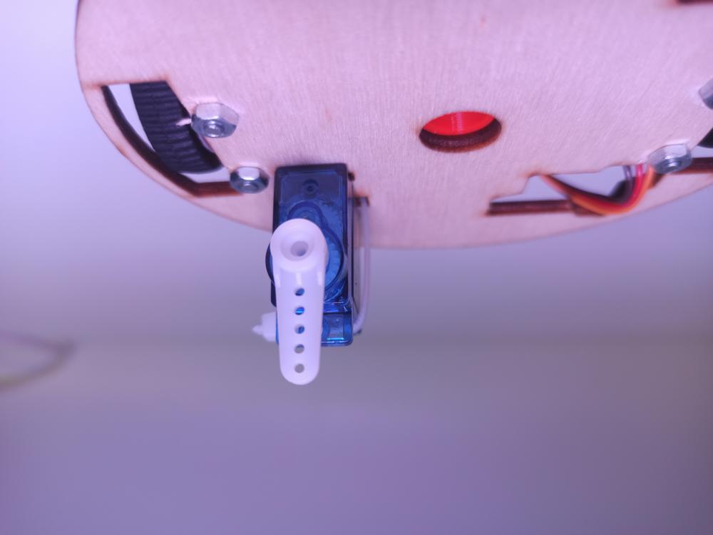

# Lekce 5 - Servo (Kreslení tužkou)

Abychom mohli používat servo, musíme ho inicializovat. K tomu slouží příkaz `#!ts const servo = new Servo(SERVO_PIN, 1, 4)`. Parametr `SERVO_PIN` specifikuje, na který pin je servo připojeno.

```ts
import { Servo } from "./libs/servo.js";
import { createRobutek } from "./libs/robutek.js";

const robutek = createRobutek("V2");

// robutek.Pins.Servo2 je pin 38
const servo = new Servo(robutek.Pins.Servo2, 1, 4);
```

Na nastavení pozice serva používáme funkci `#!ts write(POSITION)`. Parametr `POSITION` je číslo od 0 do 1023. Specifikuje úhel, na který se má servo otočit.

```ts
servo.write(0); // 0°
servo.write(512); // 90°
servo.write(1023); // 180°
```

!!! note "Pro konverzi úhlu na číslo musíme úhel vynásobit 1024 a vydělit 180"

## Kreslení tužkou

Tím, že zvedáme nebo pokládáme servo, můžeme ovládat připevněnou tužku.
Abychom si nemuseli pamatovat konkrétní hodnoty pro zvedání tužky, Robůtek má 3 předdefinované konstaty pro ovládání: `Up`, `Down` a `Unload`.
Pokud bychom do něj dávali různé druhy tužek, můžeme si samozřejmě nadefinovat vlastní.

Aby ovládací konstanty fungovaly, musí být pacička nasazena ve správné pozici. Proto musíme servo programem otočit na 0° a pacičku nasadit tak, aby směřovala přímo vzhůru.

```ts
import { createRobutek } from "./libs/robutek.js";
import { Servo } from "./libs/servo.js";

const robutek = createRobutek("V2");
const servo = new Servo(robutek.Pins.Servo2, 1, 4);

servo.write(0);
```



Jakmile máme pacičku správně nastavenou, můžeme na ni nasadit fixu.


Teď už máme všechno připraveno, takže můžeme kreslit.

Na nastavení pozice tužky zase použijeme funkci `#!ts write(POSITION)`. Místo čísla `0-1023` ale do parametru `POSITION` vložíme jednu z konstant `Up`, `Down` a `Unload`.

```ts
import { Servo } from "./libs/servo.js";
import { createRobutek } from "./libs/robutek.js";
const robutek = createRobutek("V2");

const pen = new Servo(robutek.Pins.Servo2, 1, 4); // robutek.Pins.Servo2 je pin 38

// Začne kreslit
pen.write(robutek.PenPos.Down);

// Přestane kreslit
pen.write(robutek.PenPos.Up);

// Vytáhne tužku
pen.write(robutek.PenPos.Unload);
```

!!! note "Neočekávaný výsledek"

    Pokud tento program spustíme, zjistíme, že se provede pouze poslední `write`. Program totiž nečeká na dokončení pohybu, ale příkazy pošle okamžitě po sobě. Servo pak provede pouze poslední přijatý příkaz, z našeho pohledu tedy pohyb na pozici `Unload`. V běžném programu to však nebude problém, jelikož mezi příkazy write budeme provádět i jiné příkazy, jako třeba příkaz `move`, u kterých program čeká na dokončení.

## Zadání A

Vytvořme program, který při zmáčknutí tlačítka zasune pero a druhé tlačítko, které ho vysune.

??? note "Řešení"

    ```ts
    import { Servo } from "./libs/servo.js";
    import * as gpio from "gpio";
    import { createRobutek } from "./libs/robutek.js";

    const robutek = createRobutek("V2");

    gpio.pinMode(robutek.Pins.ButtonLeft, gpio.PinMode.INPUT);
    gpio.pinMode(robutek.Pins.ButtonRight, gpio.PinMode.INPUT);

    const pen = new Servo(robutek.Pins.Servo2, 1, 4);

    gpio.on("falling", robutek.Pins.ButtonLeft, () => {
        pen.write(robutek.PenPos.Down);
    });

    gpio.on("falling", robutek.Pins.ButtonRight, () => {
        pen.write(robutek.PenPos.Up);
    });
    ```

## Zadání B

Zkombinujme poznatky z [lekce 4](../lekce4/index.md) s touto a vytvořme program, který po stisku tlačítka nakreslí fixou na papír čtverec.

??? note "Řešení"

    ```ts
    import { Servo } from "./libs/servo.js"
    import \* as gpio from "gpio"
    import { createRobutek } from "./libs/robutek.js"
    const robutek = createRobutek("V2");

    const LBTN_PIN = 2;
    const RBTN_PIN = 0;

    gpio.pinMode(LBTN_PIN, gpio.PinMode.INPUT);
    gpio.pinMode(RBTN_PIN, gpio.PinMode.INPUT);

    const pen = new Servo(robutek.Pins.Servo2, 1, 4);

    gpio.on("falling", LBTN_PIN, async () => {
        pen.write(robutek.PenPos.Down); // fixa dolů

        robutek.setSpeed(100) // Nastav rychlost na 100

        await robutek.move(0, { distance: 300 }) // Ujeď 30 cm
        await robutek.rotate(90)
        await robutek.move(0, { distance: 300 })
        await robutek.rotate(90)
        await robutek.move(0, { distance: 300 })
        await robutek.rotate(90)
        await robutek.move(0, { distance: 300 })
        await robutek.rotate(90)

        pen.write(robutek.PenPos.Up); // fixa nahoru
    });
    ```

## Výstupní ukol V1

Př stisknutí jednoho tlačítka vykreslí Robůtek kruh, při stisknutí druhého vykreslí trojúhelník.

## Výstupní úkol V2

Při stisknutí jednoho tlačítka vykreslí Robůtek první písmeno našeho jména, při stisku druhého tlačítka první písmeno našeho příjmení.
