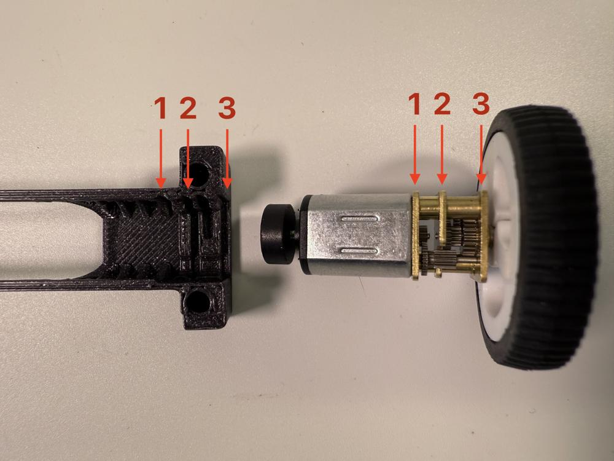
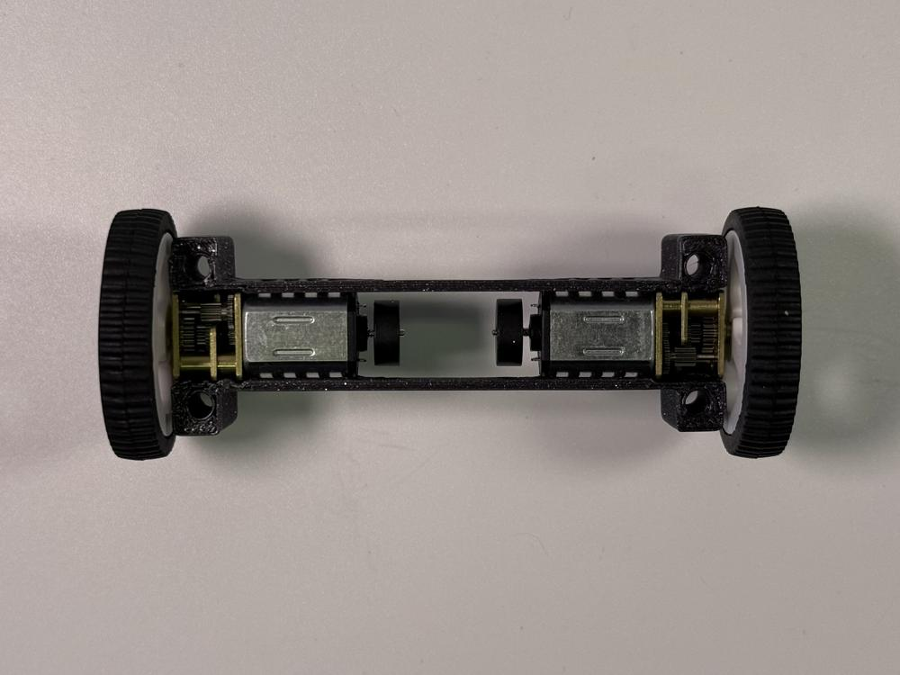
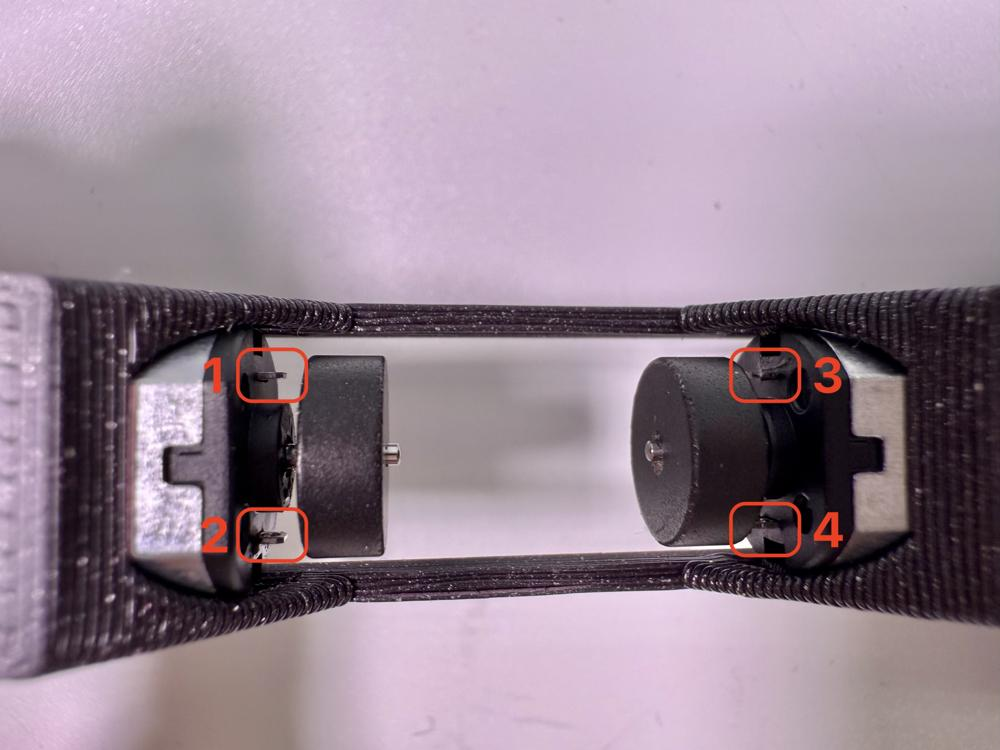
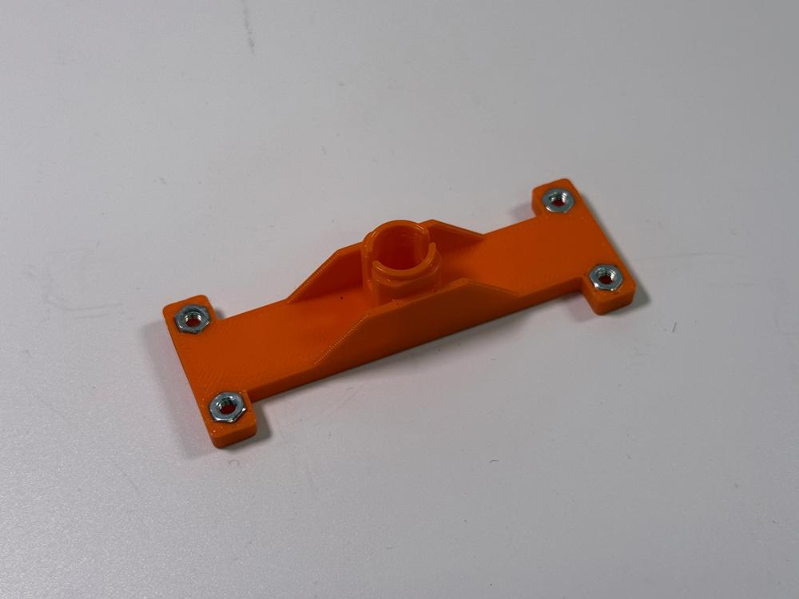
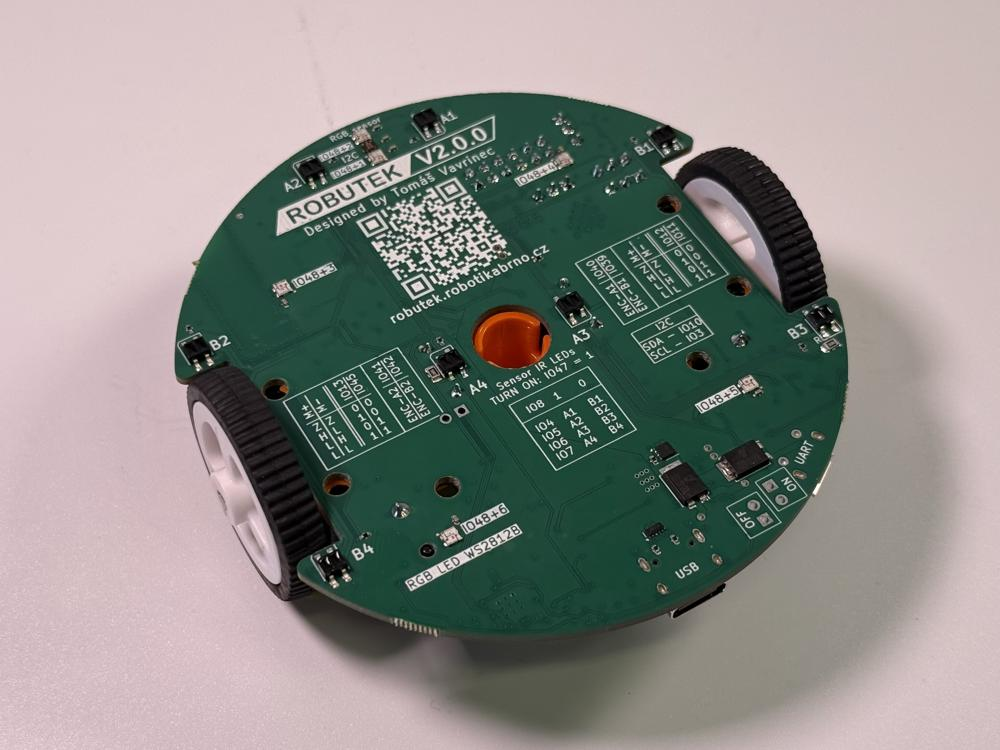
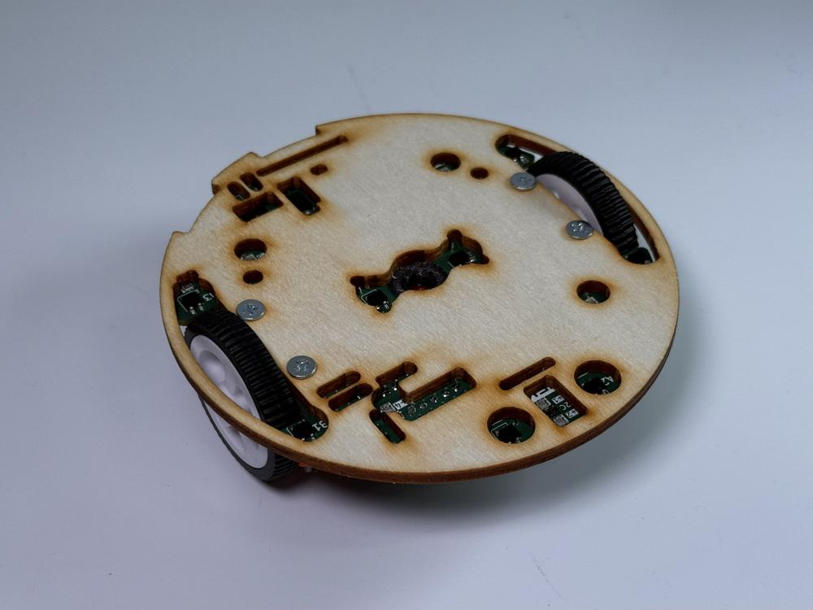
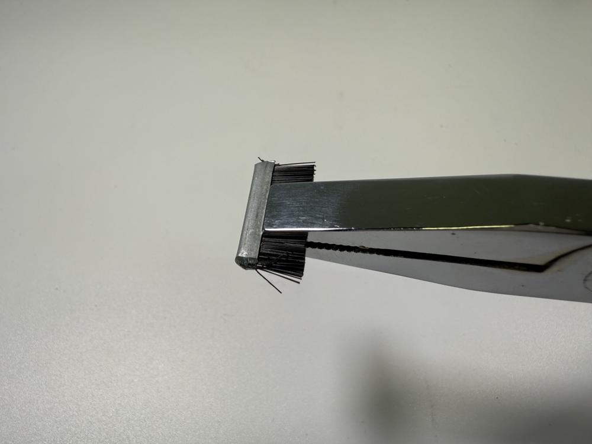
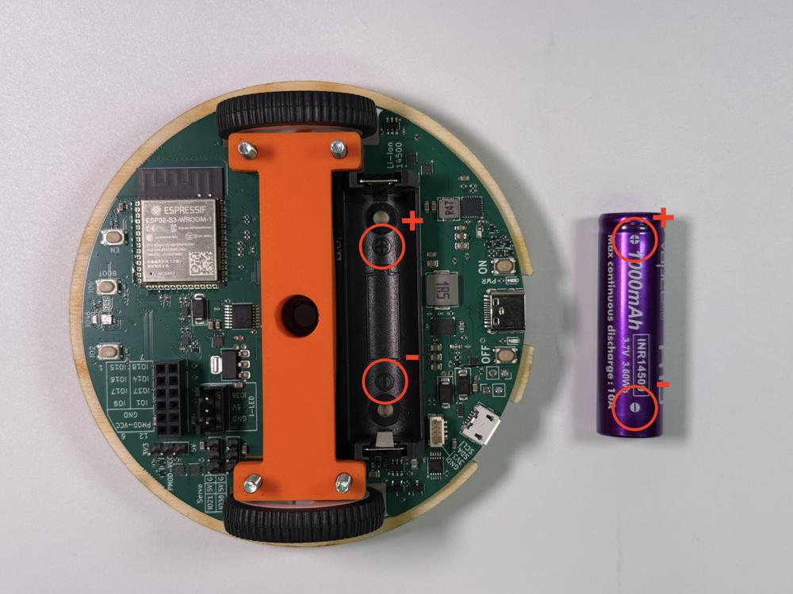

# Stage 1 - Základ
V této kapitole si postavíme samotného Robůtka.

## Seznam potřebných součástek

 - 4 šroubky M3x30
 - 4 matky M3
 - 2 motory s kolem
 - 2 magnetky (enkodéry)
 - Vložka pod motor
 - Spodní domeček pro motory
 - Vrchní domeček pro motory
 - Dřevěná základna
 - Dřevěná paluba
 - Základní deska
 - Velký kartáček
 - Malý kartáček
 - Baterie Li-ion 14500
 - Zarážka fixy

## Návod na složení

1. Ulomte okraje desky.

    
    

2. Připravte si motor s kolem a magnetku. Magnetku nasaďte tak, aby byla ve středu hřídele. Toto zopakujte pro druhé kolo.

    
    

3. Připravte si domeček pro motory.

    

4. Vsaďte oba motory do domečku.

    !!! danger "Netlačte motory do domečku silou, měly by jít vsadit lehce. Ujistěte se, že kolejničky motoru jsou zarovnány s drážkami v domečku."
    
    

5. Najděte pin heady na pohon motorů na vrchní straně destičky plošného spoje. Pomocí štípaček, sundejte jejich plastové izolátory.

    !!! danger "Dávejte si pozor aby jste pinheady neuštípli."
    
    !!! danger "Neuštípněte pin heady!"
    
    !!! danger "Neuštípněte pin heady!"
    

6. Položte vložku pod motor na destičku plošného spoje. Dbejte na její orientaci.

    

7. Nasaďte domeček s motory na vložku tak, aby se pin heady dotýkaly kontaktů motorů.

    
    
    !!! danger "Kontakty motoru musí být mezi pin heady."
    
    

8. Nasaďte vrchní domeček na spodní domeček.

    
    

9. Na spodní straně robůtka zacvakněte zarážku fixy do domečku.

    
    
    

10. Nasaďte dřevěnou základnu. Přišroubujte ji k robůtku pomocí čtyř M3x30 šroubků.

    
    !!! danger "Šrouby do dřevěné základny neutahujte silou aby neprorazily skrz destičku."
    
    

11. Připravte si kartáčky (jeden malý a jeden velký). Uchopte si kartáček kleštěmi a zatlačte ho do drážky správné velikosti (malý kartáček do malé drážky, velký kartáček do velké drážky).

    
    
    !!! danger "Zatlačte kartáčky až na doraz, aby nevylézala kovová část kartáčku."
    
    

12. Vložte baterii.

    !!! danger "Dejte si pozor na polaritu baterie."
    
    

13. Přišroubujte dřevěnou palubu.

    
    
    
    Máte hotovo!
