# Stage 1 - Základ
V této kapitole si postavíme samotného Robůtka.

## Seznam potřebných součástek

 - 4 šroubky M3x30
 - 4 matky M3
 - 2 motory s kolem
 - 2 magnetky (enkodéry)
 - Vložka pod motor
 - Spodní domeček pro motory
 - Vrchní domeček pro motory
 - Dřevěná základna
 - Dřevěná paluba
 - Základní deska
 - Velký kartáček
 - Malý kartáček
 - Baterie Li-ion 14500
 - Zarážka fixy

## Návod na složení

1. Ulomte okraje desky.

    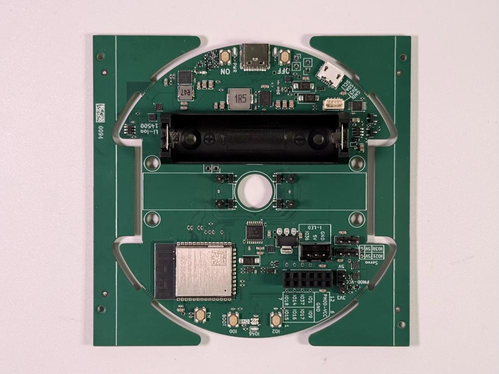
    

2. Připravte si motor s kolem a magnetku. Magnetku nasaďte tak, aby byla ve středu hřídele. Toto zopakujte pro druhé kolo.

    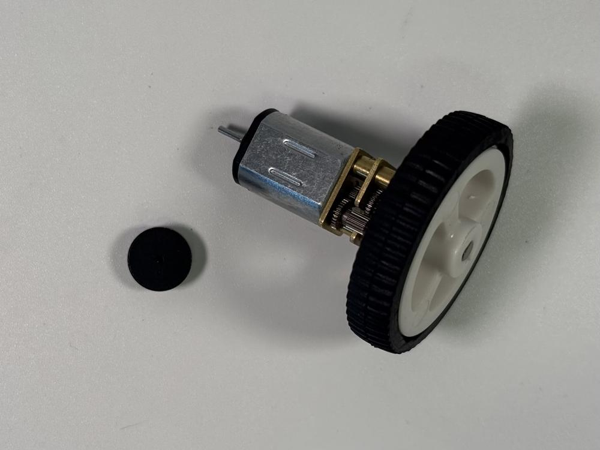
    

3. Připravte si domeček pro motory.

    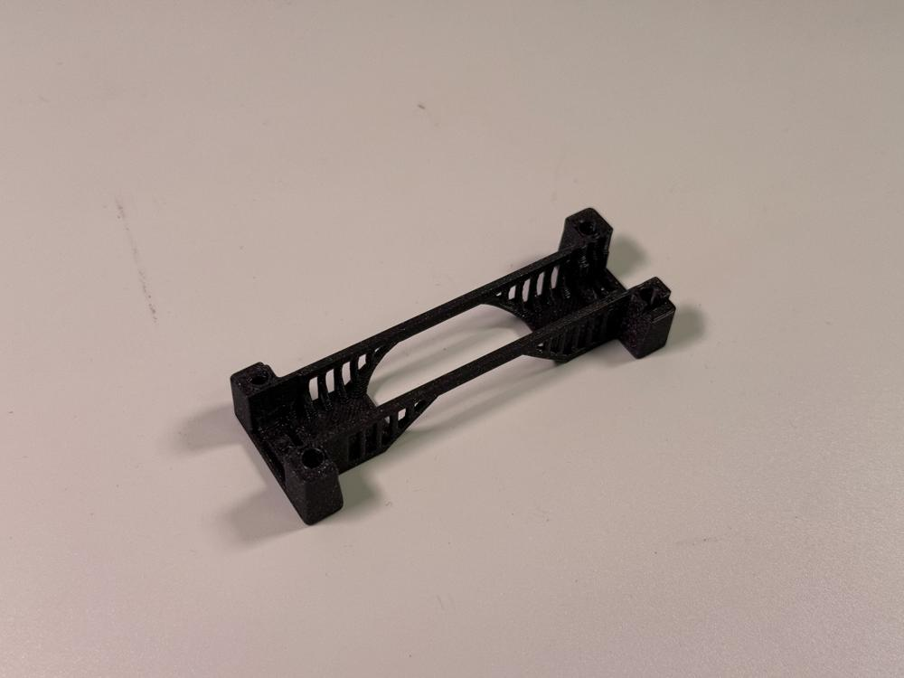

4. Vsaďte oba motory do domečku. <!-- TODO: zadefinovat otočení -->

    !!! danger "Netlačte motory do domečku silou, měly by jít vsadit lehce. Ujistěte se, zda jste motor otočili správně a že kolejničky motoru jsou zarovnány s drážkami v domečku."
    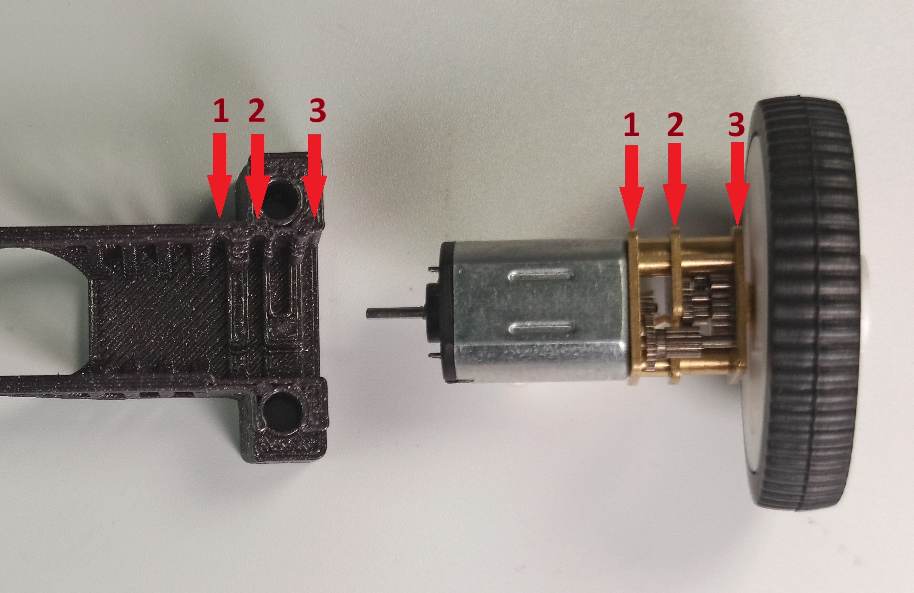
    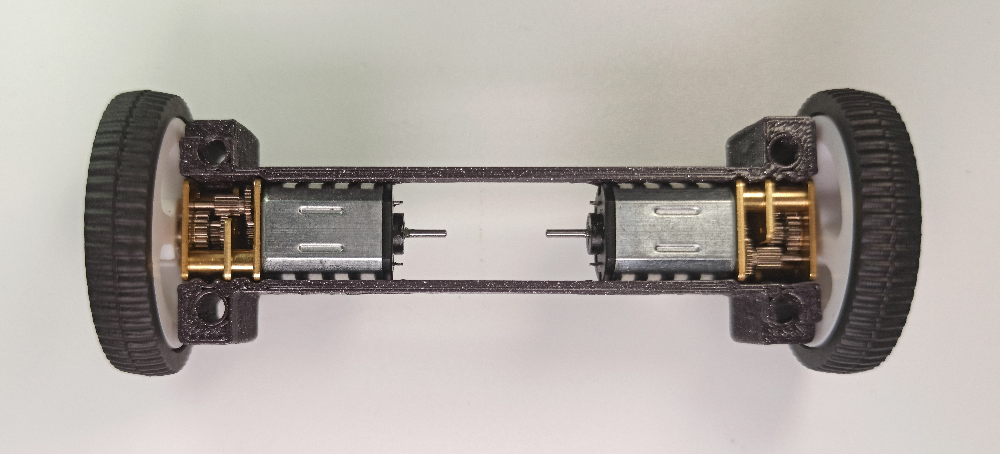

5. Pomocí malého plochého šroubováku odstraňte plastové zarážky s pinheadů. <!-- TODO: opravit fotky --> 

    !!! danger "Dávejte si pozor aby jste pinheady neohl ani neuštípli."
    
    !!! danger "Neuštípněte pin heady!"
    
    !!! danger "Neuštípněte pin heady!"
    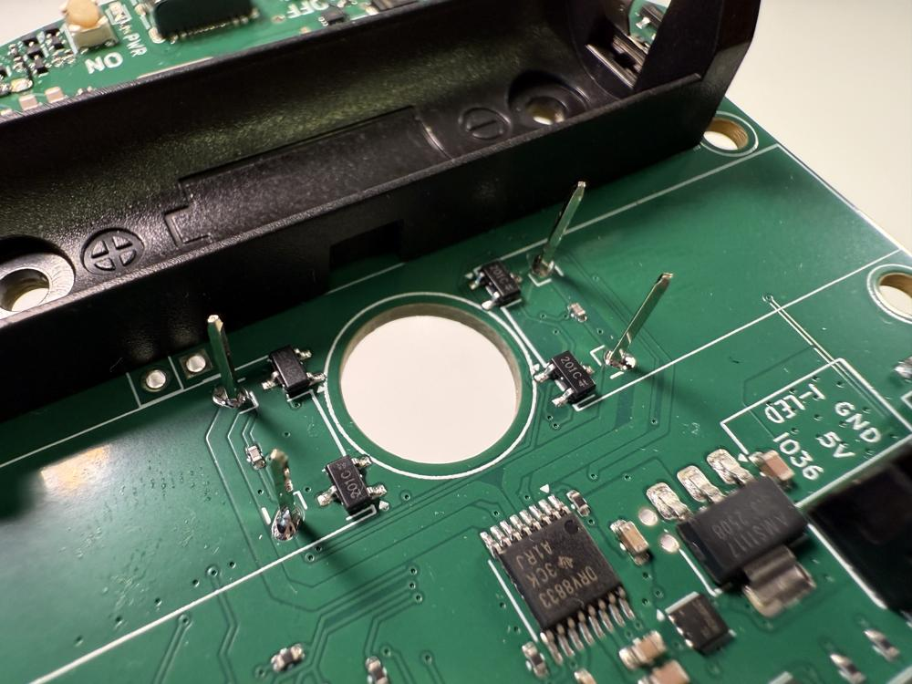

6. Položte vložku pod motor na destičku plošného spoje. Dbejte na její orientaci.

    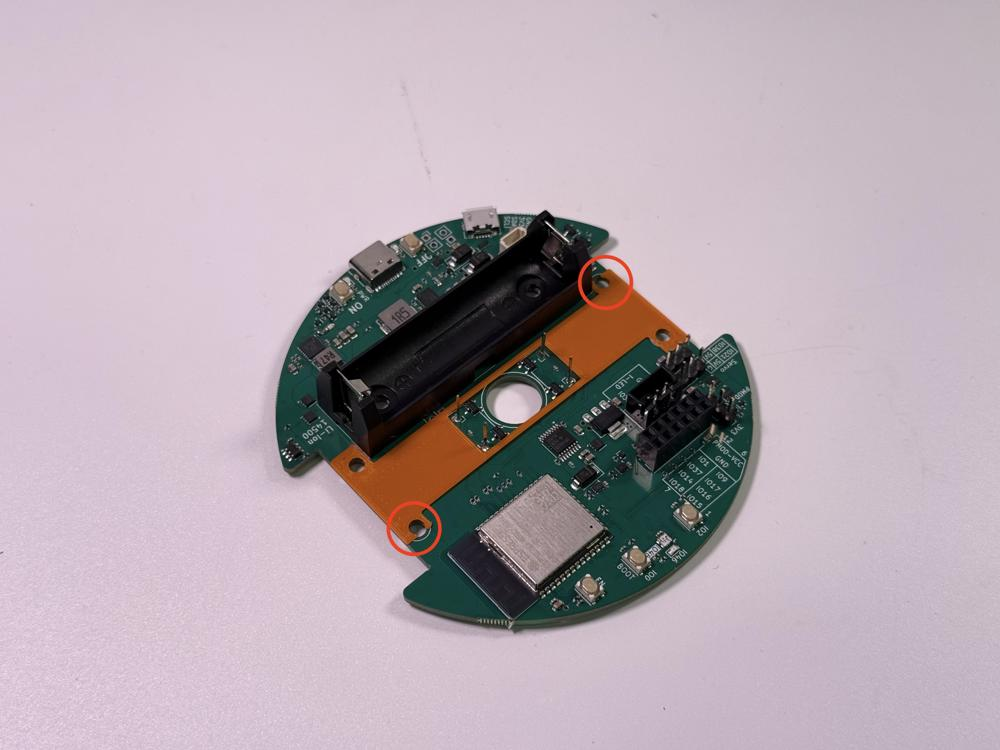

7. Nasaďte domeček s motory na vložku tak, aby se pin heady dotýkaly kontaktů motorů.

    
    
    !!! danger "Kontakty motoru musí být mezi pin heady."
    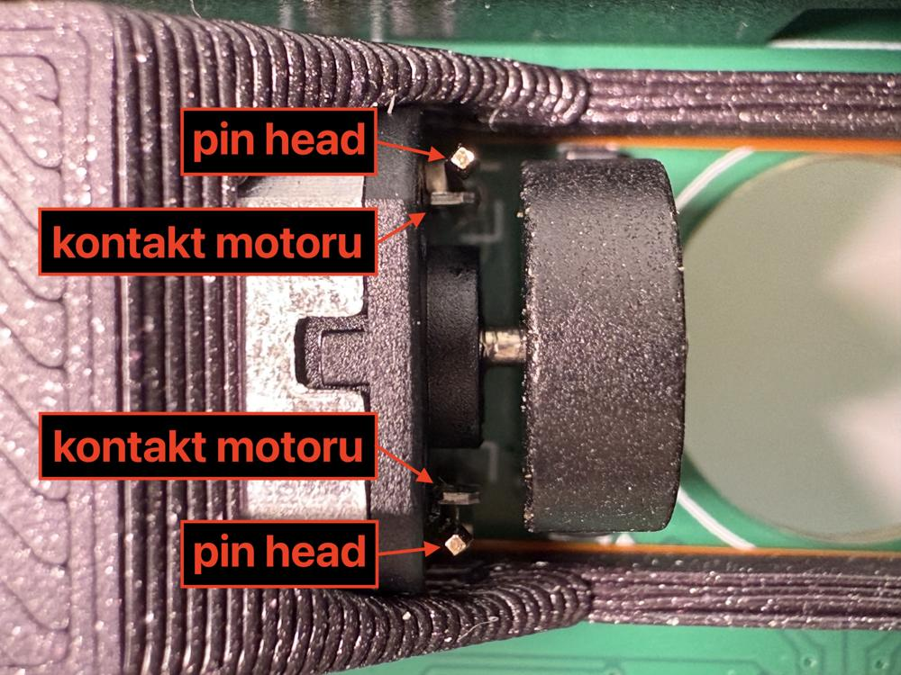
    

8. Zajdi za orgem aby ti zapájel motory. Zároveň ti zkontroluje že motory jedou jak mají.
!!! danger "Přečti si popisek kroku, je do důležité!"

9. Nasaďte vrchní domeček na spodní domeček.

    
    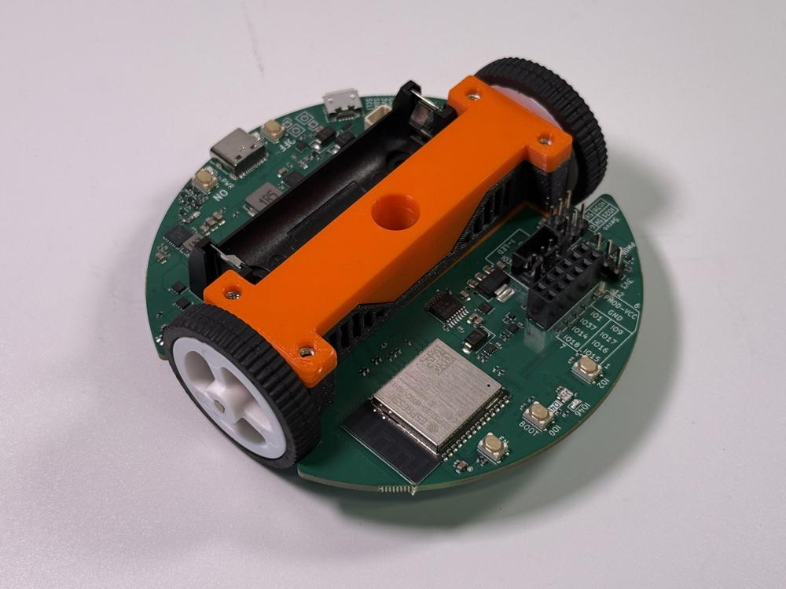

10. Na spodní straně robůtka zacvakněte zarážku fixy do domečku.

    
    
    

11. Nasaďte dřevěnou základnu. Přišroubujte ji k robůtku pomocí čtyř M3x30 šroubků.

    !!! danger "Pozor na orientaci základny, díry musí sedět na součastky na desce."
    !!! danger "Šrouby do dřevěné základny neutahujte silou, aby ji nepoškodily."
    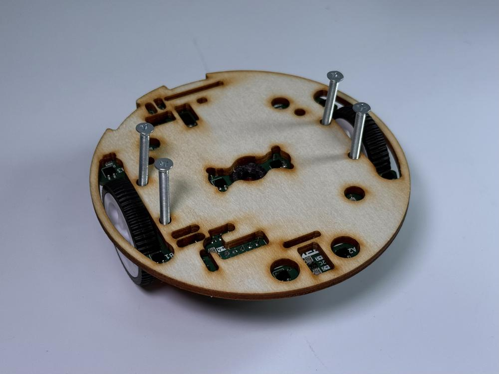
    
    

12. Připravte si kartáčky (jeden malý a jeden velký). Uchopte si kartáček kleštěmi a zatlačte ho do drážky správné velikosti (malý kartáček do malé drážky, velký kartáček do velké drážky).

    
    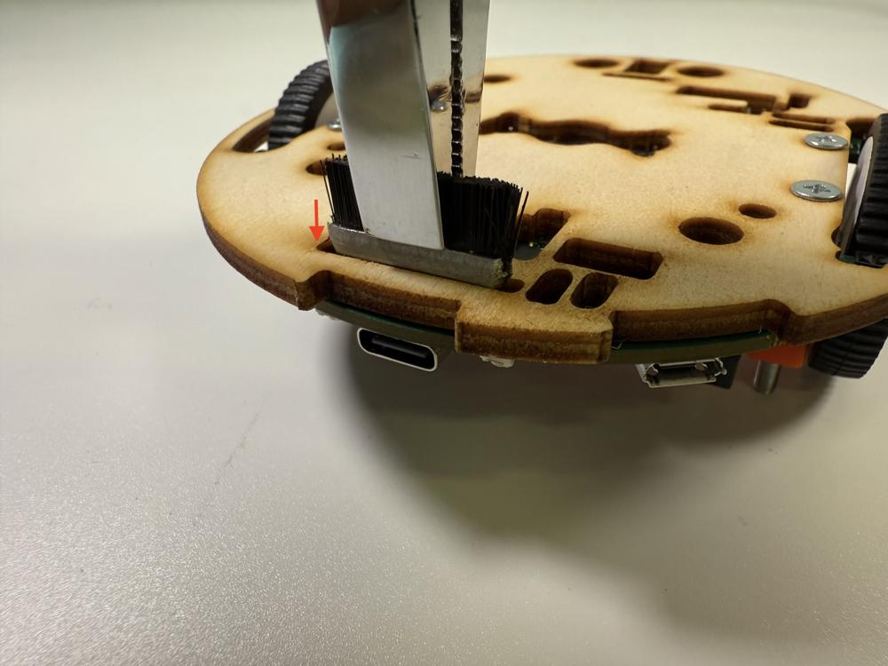
    !!! danger "Zatlačte kartáčky až na doraz, aby nevylézala kovová část kartáčku."
    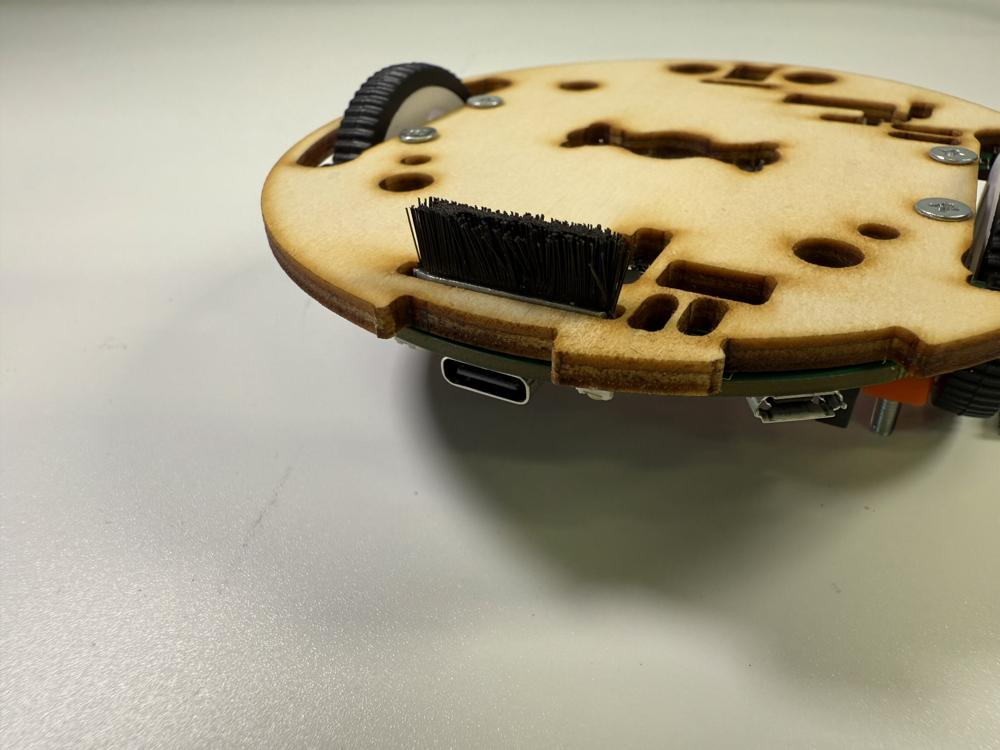
    

13. Vložte baterii.

    !!! danger "Dejte si pozor na polaritu baterie."
    
    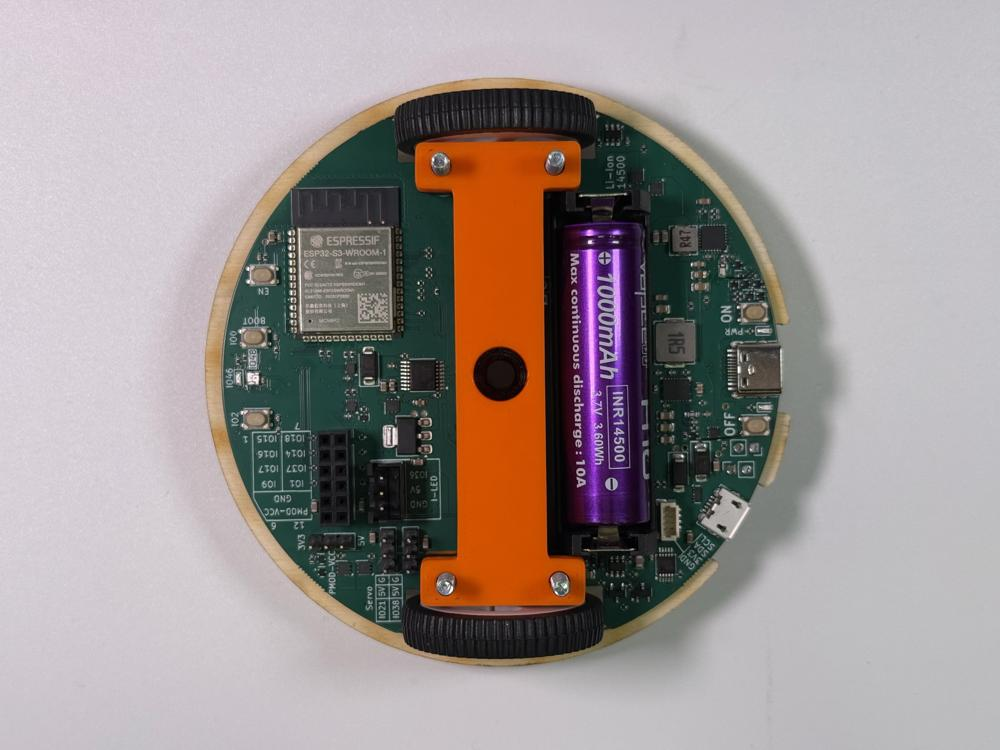

14. Přišroubujte dřevěnou palubu.

    !!! danger "Pozor na orientaci paluby, díry musí sedět na součastky na desce."
    
    
    
    Máte hotovo!

[Krok 2](stage2.md){.md-button .md-button--primary}