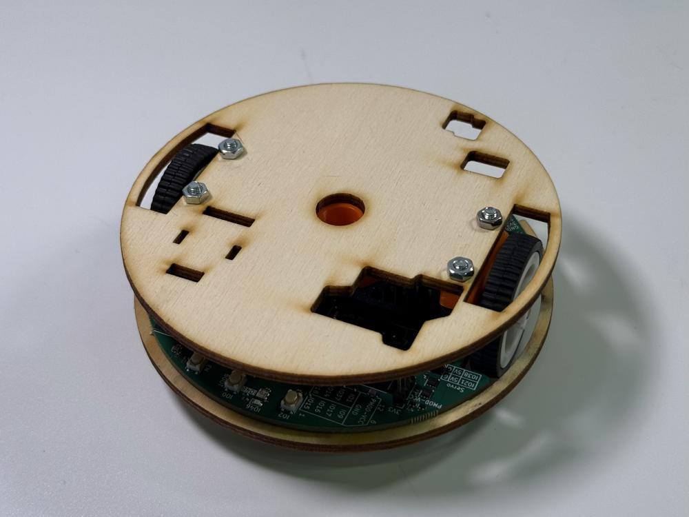
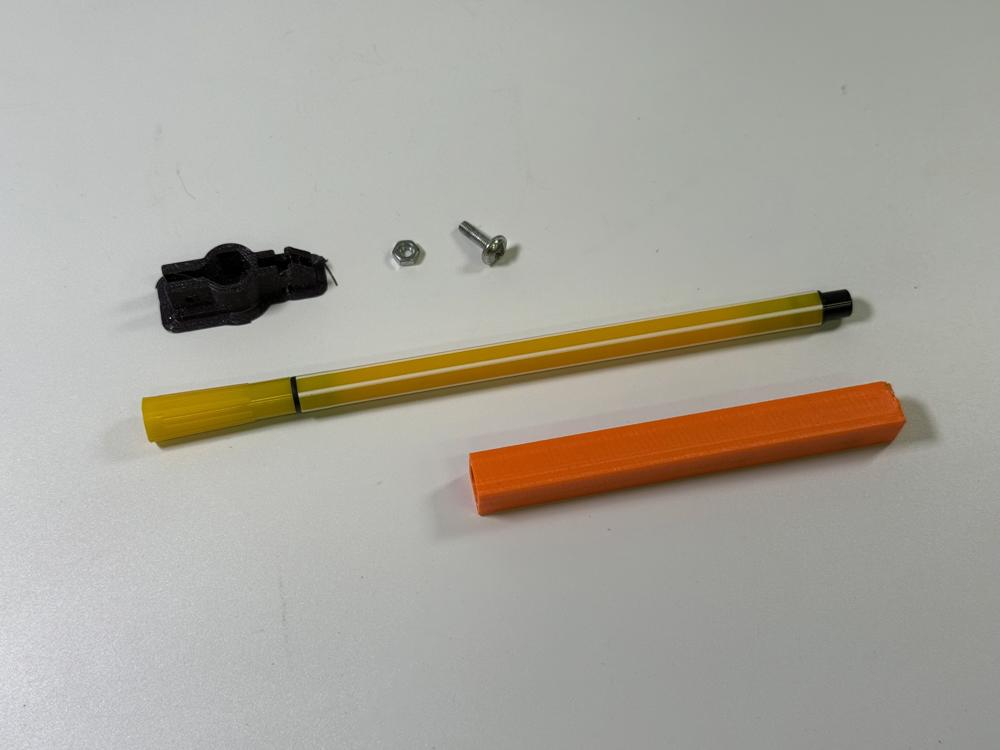
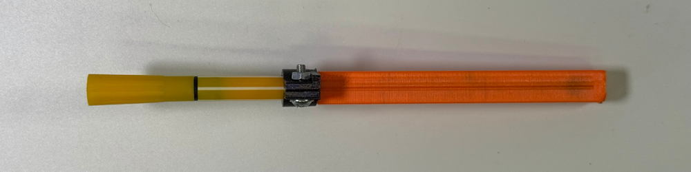
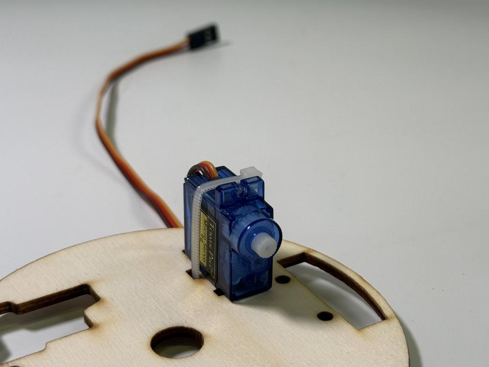
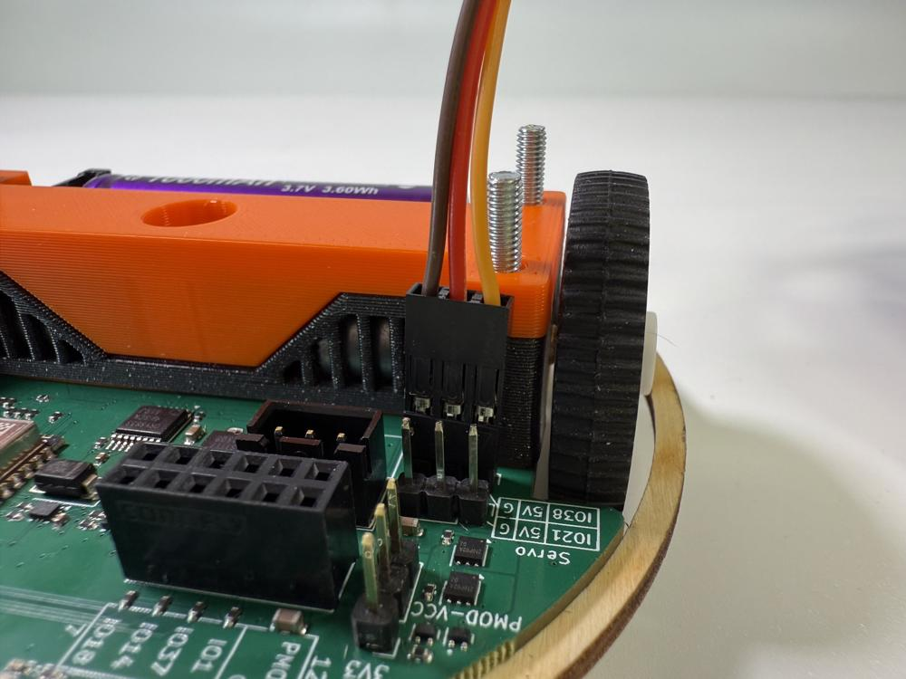
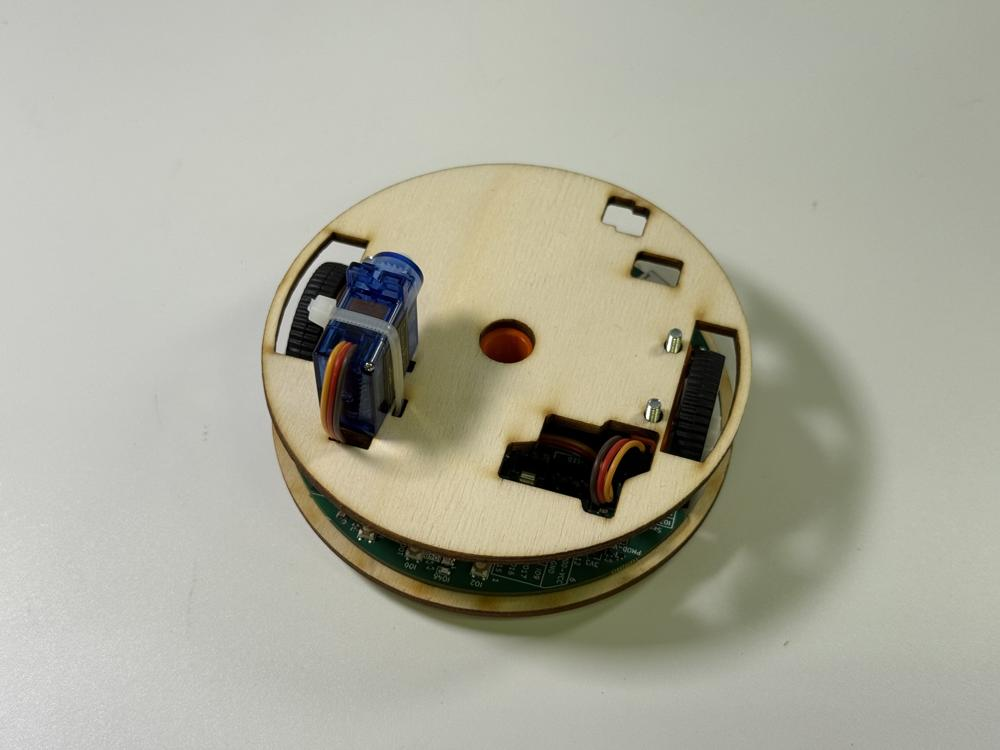

# Stage 2 - Servo, fixa

## Seznam potřebných věcí

 - Hotový robůtek ze stage 1
 - Servo motor
 - Stahovací zip pásek
 - Fixa
 - Držák na fixu
 - Šroubek a matka
 - Gumička

## Návod na složení

1. Sundejte z robůtka dřevěnou palubu (pokud ji na robůtku máte).

    
    
    

2. Připravte si fixu, držák na fixu, šroubek, matku a přípravek.

    

3. Očistěte držák na fixu.

    
    

4. Nasuňte držák na fixu.

    <!-- TODO add arrow and warning about black part orientation  -->

    

5. Nasuňte na fixu přípravek. Zatlačte ji až na doraz.

    

6. Držák přitiskněte k přípravku.

    

7. Nasaďte na držák šroubek s matkou, a sešroubujte.

    

8. Protáhněte kabel od serva dřevěnou palubou.

    

9. Posaďte servo na dřevěnou palubu.

    

10. Protáhněte stahovací pásek kolem serva.

    
    !!! danger "Utáhněte stahovací pásek tak, aby servem nešlo hnout."
    

11. Odštípněte přečnívající stahovací pásek.

    
    

12. Připojte konektor kabelu serva ke tří pinovému konektoru na základní desce robůtka.

    !!! danger "Šipka na konektoru patří na datový pin na desce!"
    
    
    

13. Přišroubujte dřevěnou palubu zpátky na robůtka.

    
    

14. Nasaďte na servo packu.

    !!! warning "Pozor na orientaci pacičky, díra s ozubeným vnitřkem musí být směrem k servu."

    
    

15. Obmotejte držák na fixu gumičkou.

    

16. Fixu dejte do robůtka a zahákněte packu serva do díry v černém dílu.

    

    !!! danger "<h2><b>S FIXOU NEJEZDĚTE ROBŮTKEM PO ZEMI, JENOM PO PAPÍŘE NA VYHRAZENÉM MÍSTĚ.</b> Lidem, co toto poruší, bude fixa zabavena!</h2>"

    
    Máte hotovo!
