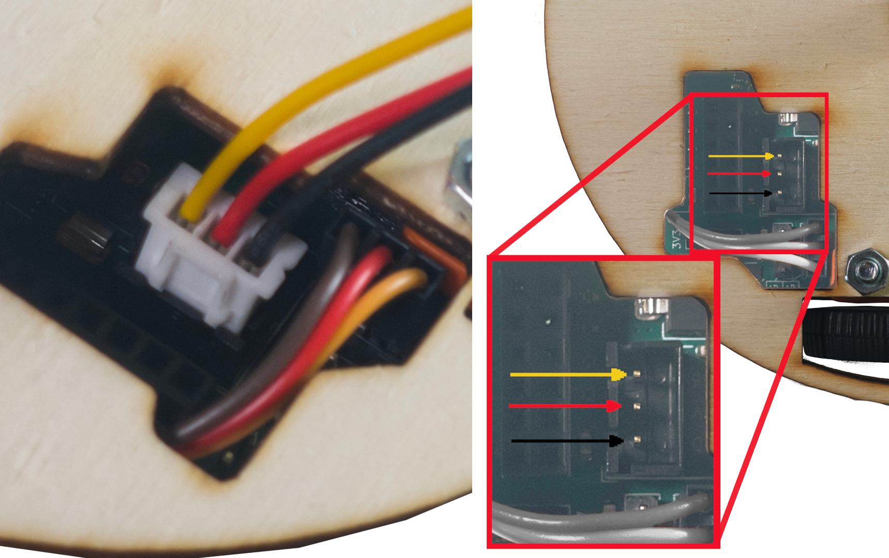

# Stage 3 - RGB pásek

!!! comment "Příslušenstí si můžete dát kamkoliv na Robůtka, ale v návodech jsou doporučené pozice."

<!-- TODO maybe update pixture and description, LED strips have IN and OUT pad instead of DIN and DOUTq -->
1. Připravte si  pásek.

    

2. Pásek připojte k Robůtkovi.

    

3. Příslušenstí si můžete dát kamkoliv na Robůtka, na obrázku je doporučené místo.

!!! danger "Pásek přidělejte **GUMOLEPEM NE SEKUNĎÁKEM !!**" 

[Krok 4 - Tlačítko](stage4.md){.md-button .md-button--primary}