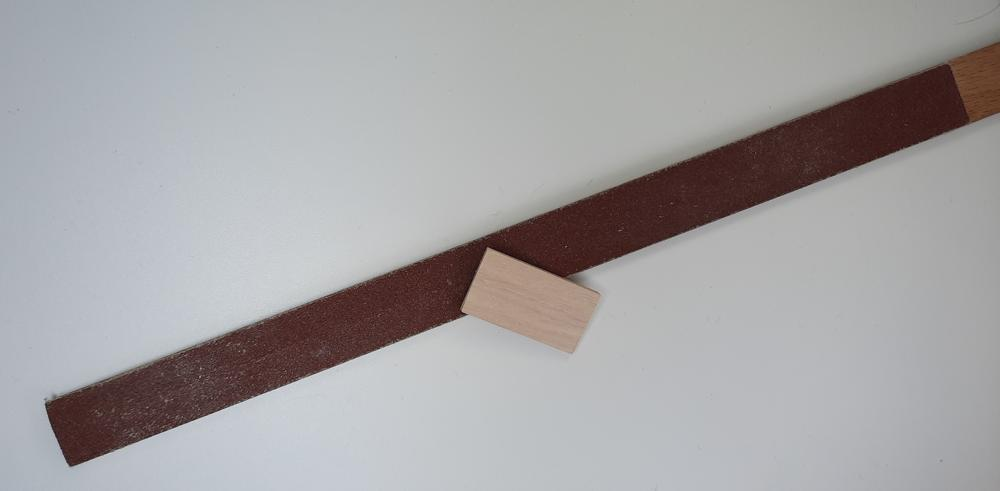
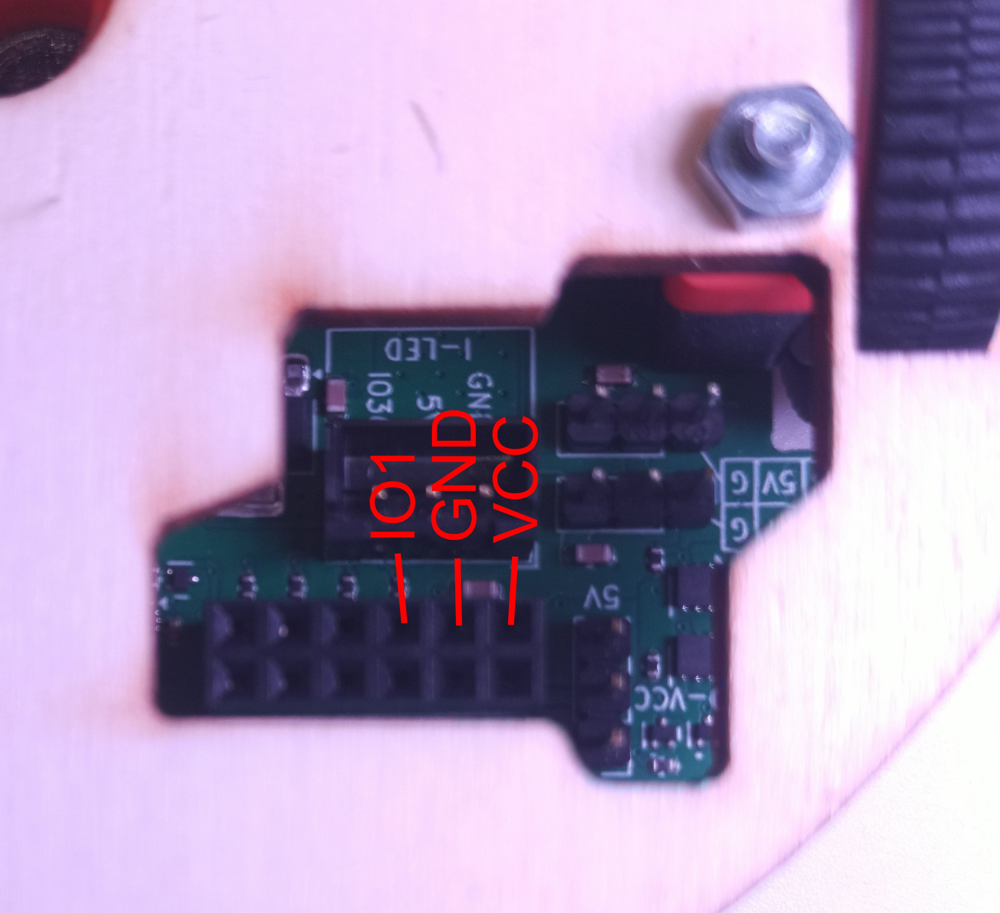

# Stage 4 - Tlačítko

!!! comment "Příslušenstí si můžete dát kamkoliv na Robůtka, ale v návodech jsou doporučené pozice."

1. Uřizneme si 3 cm dlouhý kus dřevíčka jako držák tlačítka.

    

2. Uříznutý kousek si obrousíme aby byl krásně hladký.

    

3. Přilepíme držák k tlačítku pomocí tavné pistole.

    
    

4. Tlačítko s držáčkem můžeme přilepit k Robůtkovi.

    
    

5. Nakonec si připojíme tlačítko k Robůtkovi pomocí 3x10cm kabelu (jiný než co je v pytlíčku).

    
    

| Tlačítko |     | Robůtek |
| -------- | --- | ------- |
| OUTPUT   | →   | IO1     |
| GND      | →   | GND     |
| VCC      | →   | VCC     |

[Krok 5 - Senzor vzdálenosti](stage5.md){.md-button .md-button--primary}