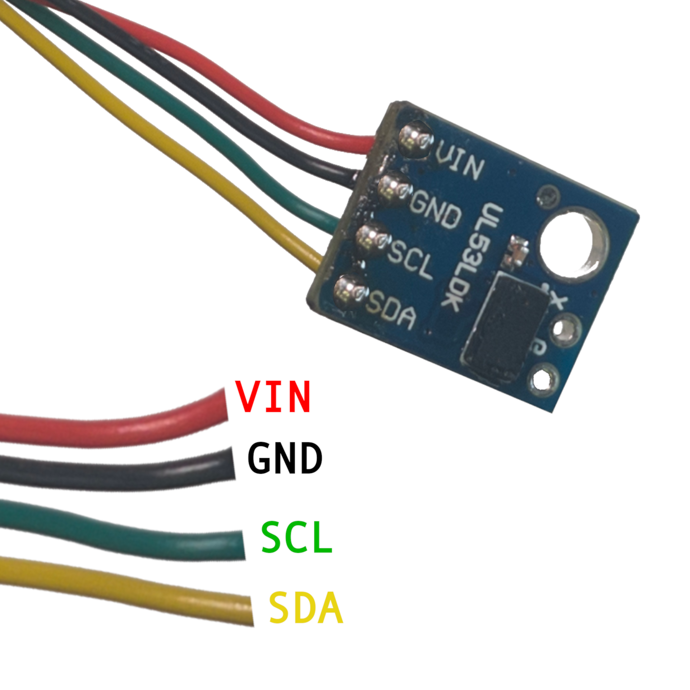

# Stage 5 - Senzor vzdálenosti
!!! comment "Senzor vzdálenosti má přední a zadní stranu. Přední strana **NESMÍ BÝT BLOKOVANÁ** aby senozor fungoval."

1. Připravte si senzor vzdálenosti a "ušup" kabel, jak je znázorněno na obrázku (kabely pájíme tak aby "trčely" ze zadní strany senzoru).
    

# Stage 5.1 - Výroba stojánku (dobrovolné)
1. Uřizněte si dva 2 cm dlouhé kusy dřevíčka.
2. Uříznuté kousky si obruste aby byly krásně hladké.
3. Herkules dejte na delší stranu jednoho z dílů.
4. Slepte do pravého úhlu

    