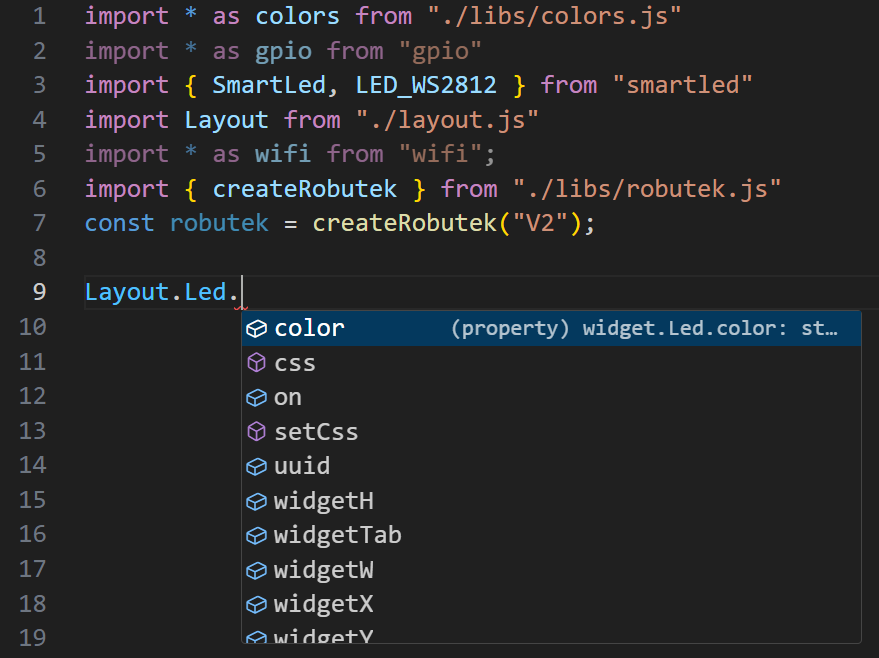

# GridUI designer

Pokud už jste si užili dost ovládání Robůtka joystickem, nebo byste si k němu rádi přidali  nějaké další ovládací prvky, můžete si upravit rozhraní zobrazované na mobilu/v prohlížeči, jak jen chcete.

Rozhraní zobrazené na ovládacím zařízení je vytvářeno pomocí souboru `layout.ts`, najdete ho vedle souboru `index.ts`, který obvykle upravujete. Na [gridui.robotikabrno.cz](https://gridui.robotikabrno.cz/) si můžete navrhnout vysněné rozhraní a stránka pro vás soubor `layout.ts` vygeneruje sama. Všimněte si, že všechny widgety mají svoje id, kterým je budeme rozlišovat v kódu.

[GridUI designer](https://gridui.robotikabrno.cz/){ .md-button .md-button--primary }

!!! tip "Nemusíte si vkládat jenom ovládací prvky, můžete si taky na své rozhraní dát třeba ledky nebo textové pole na zobrazování dat z Robůtka. "


Takhle by třeba mohlo vypadat rozhraní navržené v designeru, máme na něm posuvník s popiskem, kterým si budeme nastavovat barvu ledek na robůtkovi, ledku, kterou budeme blikat stejnou barvou a textové pole, do kterého budeme vypisovat RGB hodnoty nastavené barvy.

Tady máte ke stažení popsaný projekt (nastavení barvy ledky na desce, blikající ledka stejné barvy na rozhraní...).

=== "Odkaz"
    ```
    https://robutek.robotikabrno.cz/v2/robotExtensions/blokGridUI/colors-gridui.tar.gz
    ```
=== "Zip"
    [Stáhnout ZIP](colors_gridui.zip){ .md-button .md-button--primary }


## Spuštění
```ts
import * as colors from "./libs/colors.js";
import * as gpio from "gpio";
import { SmartLed, LED_WS2812 } from "smartled";
import Layout from "./layout.js";
import * as wifi from "wifi";
import { createRobutek } from "./libs/robutek.js";
const robutek = createRobutek("V2");

// změň mě!
const OWNER = "owner";
const DEVICE_NAME = "Robutek";

Layout.begin(OWNER, DEVICE_NAME, builder => {
    builder.SetColor.onChanged(slider => {
        // kód spuštěný změnou na posuvníku
    });
});
```
Po připojení robůtka k wi-fi (popsáno v [lekci 1](../lekce1/index.md#dalkove-ovladani)) inizializujeme rozhraní funkcí `Layout.begin()`, které v argumentech předáváme jméno vlastníka, jméno zařízení a blok kódu, ve kterém nastavíme události spouštěné změnami v rozhraní. Tak zrovna `builder.SetColor.onChanged(slider => { // kód zde })` bude obsahovat kód, který se spustí, když widget s id `SetColor` projde nějakou změnou. V tomto případě je daný widget náš posuvník a změnou bude, když jím někdo posune. V proměnné `slider` je našemu kódu předán stav posuvníku, takže si poté můžeme vyčíst třeba jeho aktuální hodnotu takto:

```ts
let hodnota = slider.value;
```

## Upravování widgetů
Tyto události a reakce na ně musí být definovány uvnitř funkce `Layout.begin()`, ale zapisovat do widgetů můžeme odkudkoliv z kódu. Pojďmě začít blikat ledkou.
```ts
setInterval(() => {
    Layout.Led.on = !Layout.Led.on; // bliká ledkou na rozhraní
}, 500);
```

Nemusíme ale ledce nastavovat jenom jestli je zapnutá nebo vypnutá. Vlastně můžeme měnit všechny její vlastností, které jsem si nastavili v designeru.


!!! info "Našeptávač se ve VSCode zobrazuje sám, ale pokud vám zmizí, znovu si ho můžete zobrazit stisknutím ++ctrl+space++. "

Jak vidíte, našeptávač nám nabízí přístup k barvě stavu, výšce, šířce, pozici... Prostě ke všem vlastnostem ledky, které si můžeme v designeru nastavit. Některým z nich můžeme v kódu prostě přiřadit hodnotu a ona se projeví na rozhraní (viz příklad blikání ledkou na rozhraní v GridUI). Když si potom jednu vlastnost vybereme a najedeme na ni myší, ukáže se nám, jaký typ hodnoty požadují. Vlastnost `.on` u ledky bere booleanskou hodnotu, vlastnost `.widgetH` číslo, které určuje výšku widgetu, a `.color` string ve formátu `#ffffff` (RGB hodnoty v hexadecimální soustavě).


Obdobně snadno přijdete na všechno, co se dá vyvádět s ostatními widgety. Ještě jedna věc: nastavovat hodnoty můžete všem vlastnostem, které jsou speciální pro konkrétní widget (barva, velikost fontu, hodnota posuvník atd.) zatímco k obecným vlastnostem, jako je pozice, velikost widgetu a uuid, můžete přistupovat pouze ke čtení.

Pohled na jednotlivé widgety a jejich vlastnosti je dostupný v dalším bloku.

[Widgety v GridUI](widgets.md){ .md-button .md-button--primary }
