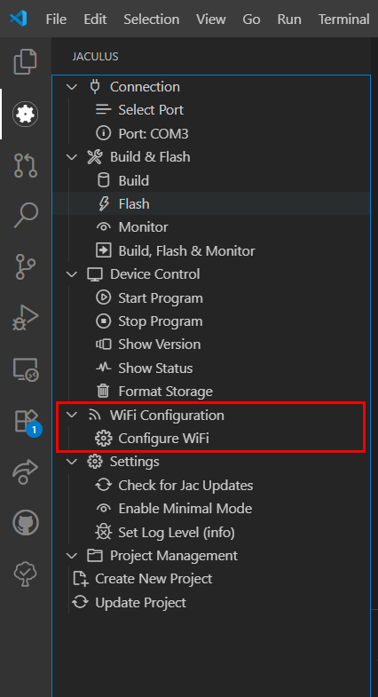
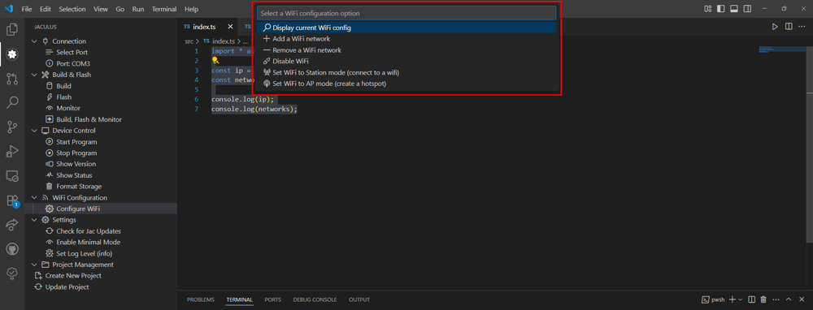

# Konfigurace WiFi
Konfiguraci provádíme přes Jaculus extension pod záložkou `WiFi Configuration`. Pro konfiguraci musí být Robůtek připojený k počítači a musí být vybraný správný port. 



Kliknutím na tlačítko `Configure WiFi` se nám otevře menu.



V menu můžeme vybrat z několika možností.

 - `Display current WiFi config` - vypsání současné WiFi konfigurace Robůtka do konzole 
 - `Add a WiFi network` - přidání nové WiFi, vyžaduje jméno WiFi a heslo
 - `Remove a WiFi network` - odstranění WiFi sítě z paměti Robůtka, vyžaduje jméno WiFi
 - `Disable WiFi` - vypnutí Wifi Robůtka
 - `Set WiFi to Station mode (connect to wifi)` - zapnutí WiFi v režimu stanice, Robůtek se připojuje k WiFi
 - `Set WiFi to AP mode (create a hotspot)` - zapnutí WiFi v režimu hotspotu, Robůtek vytváři hotspot, ostatní zařízení se připojují k němu

!!! danger "Problémy s WiFi"
    
    Zapnutá WiFi může Robůtkovi způsobovat problémy. Proto WiFi vypínáme, pokud ji zrovna nepotřebujeme.

# Funkce s WiFi

Knihovny pro Robůtka nám dávají k dispozici 2 funkce.

 - `currentIp()` - vrací současnou konfiguraci WiFi
 - `listNetwork()` - vrací pole všech uložených WiFi sítí

    ```ts
    import * as wifi from 'wifi'

    const ip = wifi.currentIp();
    const networks = wifi.listNetworks();

    console.log(ip);
    console.log(networks);
    ```


